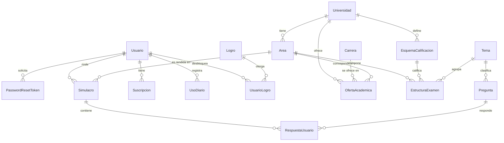

# RumboU — Plataforma de preparación para el examen de admisión (UNI y UNMSM)

**Curso:** CS 2031 Desarrollo Basado en Plataformas — UTEC
**Integrantes:** Marco Bautista, Fabiana Gomez, Juan Carlos Vergara, Zoe Garrido Cantoni

> Este README cumple doble función, como exige la rúbrica de la Semana 7: es la documentación técnica para levantar el proyecto en local, y también el informe narrativo de la entrega (portada, introducción, modelo de entidades, seguridad, etc.).

---

## Índice

1. [Instalación y ejecución local](#instalación-y-ejecución-local)
2. [Introducción](#introducción)
3. [Identificación del problema o necesidad](#identificación-del-problema-o-necesidad)
4. [Descripción de la solución](#descripción-de-la-solución)
5. [Modelo de entidades](#modelo-de-entidades)
6. [Manejo de errores](#manejo-de-errores)
7. [Medidas de seguridad implementadas](#medidas-de-seguridad-implementadas)
8. [Eventos y asincronía](#eventos-y-asincronía)
9. [GitHub y gestión del proyecto](#github-y-gestión-del-proyecto)
10. [Conclusión](#conclusión)
11. [Apéndices](#apéndices)

---

## Instalación y ejecución local

### Requisitos previos

- Java 21
- Docker Desktop corriendo
- Maven (se puede usar el wrapper `mvnw` incluido, no hace falta instalarlo aparte)

### Base de datos

Este proyecto usa PostgreSQL corriendo en Docker. Para levantarlo:

```
docker compose up -d
```

Esto crea un contenedor de PostgreSQL escuchando en el puerto **5433** de tu máquina (no el 5432 por defecto, ver nota abajo). Las credenciales están en `docker-compose.yml` y deben coincidir con `src/main/resources/application.properties`.

Para verificar que quedó corriendo:

```
docker ps
```

### ⚠️ Nota sobre el puerto 5432

Si en tu computadora ya tienes PostgreSQL instalado directamente en Windows (no en Docker) — por ejemplo de otro curso o proyecto — es muy probable que ya esté usando el puerto 5432. Cuando eso pasa, Docker deja el contenedor "corriendo" sin avisar del conflicto, pero tu aplicación termina conectándose al PostgreSQL nativo en vez del de Docker, y falla con un error de autenticación (`password authentication failed`) aunque las credenciales en `application.properties` sean correctas.

Por eso este proyecto usa el puerto **5433** en el host (`"5433:5432"` en `docker-compose.yml`) en vez del 5432 estándar. Si igual te aparece ese error, revisa si tienes un servicio de PostgreSQL nativo corriendo (`services.msc` en Windows, busca algo como `postgresql-x64-...`) y confirma que `application.properties` apunte al puerto 5433, no al 5432.

### ⚠️ Nota sobre TestContainers en Windows

El BOM de Spring Boot 3.3 fija el núcleo de TestContainers en 1.19.8, cuya librería interna `docker-java` es anterior a la API de Docker Desktop 29. Con esa versión, los tests que usan `@Testcontainers` fallaban en Windows con un error como `BadRequestException (Status 400: ...)` al conectarse por el "named pipe". Por eso el `pom.xml` declara la propiedad `testcontainers.version` en 1.21.4, que alinea el núcleo con los módulos `junit-jupiter` y `postgresql`. Con Docker Desktop abierto, `./mvnw test` corre los 110 tests sin ninguna opción adicional.

### Variables de entorno

Ninguna credencial real vive en el repositorio. Las que ya usa el código:

| Variable | La usa | Obligatoria en |
|---|---|---|
| `JWT_SECRET` | `auth/JwtService`, para firmar los tokens | Producción (en local tiene un valor de desarrollo por defecto en `application.properties`) |
| `SPRING_DATASOURCE_URL`, `SPRING_DATASOURCE_USERNAME`, `SPRING_DATASOURCE_PASSWORD` | Conexión a PostgreSQL | Producción (en local apuntan por defecto al Postgres del `docker-compose`) |
| `PORT` | Puerto HTTP; lo inyecta la plataforma de despliegue | Producción (en local, 8080) |
| `SHOW_SQL` | Imprime el SQL de Hibernate en el log | Opcional (`true` por defecto; en producción se pone `false`) |
| `GEMINI_API_KEY` | `contenido/gemini/GeneradorPreguntasRunner` y el tutor de IA del plan PRO | Al generar preguntas con IA y al usar el tutor |
| `MP_ACCESS_TOKEN` | `suscripcion/MercadoPagoService`, para crear la preaprobación de pago | Al crear suscripciones PRO |
| `MAIL_HOST`, `MAIL_PORT`, `MAIL_USERNAME`, `MAIL_PASSWORD` | `correo/EmailService` (SMTP) | Al enviar correos reales (en local apunta a `localhost:1025`, por ejemplo Mailpit o Mailtrap) |

Todas siguen el mismo patrón: variable de entorno con valor por defecto vacío o de desarrollo, nunca commiteadas. La aplicación arranca aunque falten las de Gemini, Mercado Pago y correo; esas funcionalidades fallan de forma controlada (`ExternalServiceException` → 502) hasta que se configuran.

### Ejecutar el seed del catálogo

Los datos oficiales del catálogo académico (universidades, áreas, esquemas de calificación, temas con su temario y estructura del examen) viven en archivos CSV en `src/main/resources/seed/` y se cargan con el profile `seed`:

```bash
./mvnw spring-boot:run -Dspring-boot.run.profiles=seed
```

Es idempotente: se puede correr varias veces sin duplicar filas. Los valores de puntaje y penalidad **no** están en el código, cumpliendo la regla de arquitectura del proyecto.

### Ejecutar la aplicación

Desde el IDE: correr la clase `BackendApplication`. Desde terminal: `./mvnw spring-boot:run`.

### Link a producción

**https://rumbou-backend-production.up.railway.app**

La API está desplegada en **Railway** con una base de datos **PostgreSQL gestionada en la nube**, dentro del mismo proyecto y conectada por red privada. Cómo está armado:

- **Contenedor propio:** el `Dockerfile` de la raíz compila el jar en una etapa de build con Maven y deja una imagen final liviana solo con el runtime de Java 21. Railway lo detecta y lo construye automáticamente.
- **Despliegue continuo:** cada merge a `main` dispara un nuevo build y despliegue. El CI de GitHub Actions corre antes, sobre el pull request, así que a producción solo llega código con la suite de tests en verde.
- **Configuración por variables de entorno:** las mismas de la tabla anterior, cargadas en el panel de Railway; ninguna credencial está en el repositorio.
- **Datos oficiales cargados:** el seed del catálogo se ejecutó una vez contra la base de producción con el profile `seed`.
- **Portabilidad:** al estar containerizada, la misma imagen puede moverse a AWS (App Runner, ECS o Elastic Beanstalk + RDS) sin cambios en el código; solo cambian las variables de entorno. Esa migración queda como paso opcional si el curso entrega el acceso a la cuenta.

Al abrir la URL raíz en el navegador se recibe un `401` en JSON: es la respuesta esperada de la API, porque casi todos los recursos exigen un token. Para comprobar que el servicio está vivo sin token existe `GET /api/v1/health` ([abrirlo](https://rumbou-backend-production.up.railway.app/api/v1/health)), que responde `{"status":"ok", ...}` y es también el health check de la plataforma. Los demás endpoints públicos (`/api/v1/auth/register`, `/api/v1/auth/login`, etc.) se prueban desde la colección de Postman, cuya variable `baseUrl` ya apunta a esta URL.

---

## Introducción

### Contexto

En Perú, el ingreso a universidades públicas como la UNI (Universidad Nacional de Ingeniería) y la UNMSM (Universidad Nacional Mayor de San Marcos) se decide mediante un examen de admisión altamente competitivo, donde cada universidad — e incluso cada área dentro de una misma universidad — tiene su propia estructura de prueba, su propio sistema de puntaje con penalidad por respuesta incorrecta, y su propio puntaje de corte por carrera, que varía en cada proceso de admisión. Prepararse bien exige mucho más que estudiar contenido: exige practicar bajo las reglas exactas del examen real y entender qué tan cerca o lejos se está del puntaje que efectivamente ingresó en procesos anteriores.

RumboU es una API REST construida en Spring Boot como proyecto del curso CS2031 (Desarrollo Basado en Plataformas, UTEC), pensada como el backend de una plataforma de preparación para este tipo de exámenes, en el escenario que cubre a UNI y UNMSM.

### Objetivos del proyecto

- Permitir que un postulante elija una universidad, área y carrera objetivo, y rinda simulacros que repliquen fielmente el examen real de esa universidad (misma cantidad de preguntas por bloque, mismo valor de acierto y penalidad).
- Calcular métricas que le den una noción concreta de su avance: el Puntaje Simulado Proyectado (PSP) y el Índice de Progreso (IP) respecto al puntaje del último ingresante de su carrera.
- Mantener un banco de preguntas propio, generado con apoyo de IA y siempre revisado por una persona antes de usarse en un simulacro real.
- Incentivar la constancia con mecánicas de gamificación (racha diaria, XP, logros).
- Sostener el proyecto con un modelo freemium: un plan gratuito con límites de uso y un plan PRO con simulacros ilimitados y funcionalidades adicionales.

---

## Identificación del problema o necesidad

### Descripción del problema

Los postulantes suelen prepararse con material genérico (academias preuniversitarias, bancos de preguntas descontextualizados) que no refleja con exactitud la estructura de puntaje de la universidad y área a la que postulan — una misma pregunta de matemática, por ejemplo, puede valer y penalizar de forma completamente distinta entre la prueba de Aptitud de la UNI y la sección de Conocimientos de la UNMSM. Además, rara vez existe una forma clara de traducir un puntaje simulado a "qué tan cerca estoy de ingresar a mi carrera específica", porque eso depende del puntaje real del último ingresante, un dato que cambia cada proceso y por carrera.

### Justificación

El acceso a una preparación de calidad y personalizada suele estar limitado a quienes pueden pagar academias preuniversitarias costosas. Una plataforma digital que modele con precisión las reglas de cada examen — sin hardcodear esas reglas en el código, sino tratándolas como datos configurables — permite escalar esa preparación a más personas, y hacerlo de forma que agregar una tercera o cuarta universidad en el futuro sea un cambio de datos, no de arquitectura. Esa es precisamente la regla de diseño no negociable del proyecto: ningún valor de puntaje, penalidad o corte de admisión vive en el código.

---

## Descripción de la solución

### Funcionalidades implementadas

**Completo y probado:**
- ✅ Registro, login, JWT con roles (`USER`/`ADMIN`) embebidos en el token, refresh tokens, y recuperación de contraseña de un solo uso.
- ✅ Motor de simulacros: generación de la prueba según la estructura real del área, calificación con penalidad configurable por esquema, cierre y cálculo de PSP — probado contra los 4 esquemas reales de UNI y UNMSM.
- ✅ Banco de preguntas: CRUD protegido por rol, filtros paginados, generación asistida por Gemini con validación automática y aprobación humana obligatoria antes de usarse en un simulacro.
- ✅ Gamificación: racha diaria y XP actualizados al finalizar un simulacro, catálogo de logros.
- ✅ Tutor de IA del plan PRO: explicación personalizada con Gemini, con tope diario controlado por `PlanService`.
- ✅ Catálogo académico: modelo completo y **seed reproducible** desde CSV con los datos oficiales de UNI y UNMSM (esquemas de calificación, 22 temas con temario y estructura del examen).
- ✅ Suscripción PRO: `PlanService` como puerta única de límites, creación de la preaprobación en Mercado Pago, webhook con idempotencia (tabla `pagos_webhook`) y activación del plan por evento.
- ✅ Correo transaccional asíncrono con plantillas Thymeleaf: confirmación de registro, recuperación de contraseña y pago aprobado, disparados por eventos.
- ✅ Deployment en Railway con PostgreSQL en la nube, contenedor Docker y despliegue continuo desde `main`.

**En desarrollo activo:**
- 🔧 Segunda parte del seed: carreras y ofertas académicas (puntaje del último ingresante) y las áreas A, D y E de UNMSM.
- 🔧 Banco de preguntas real, generado por tema a partir del temario cargado y aprobado por un humano.
- 🔧 Cálculo de progreso (`progreso/`): Índice de Progreso (IP) respecto al puntaje de corte y dominio por tema.
- 🔧 Conectar el chequeo de límites de `PlanService` al inicio de simulacros (hoy solo protege al tutor de IA).

### Tecnologías utilizadas

- Java 21, Spring Boot 3.3.5, Maven
- Spring Data JPA + Hibernate, PostgreSQL (Docker en local)
- Spring Security con JWT (incluye refresh tokens)
- JUnit 5, Mockito, TestContainers, MockMvc
- GitHub Actions (CI)
- Mercado Pago (pagos) y Google AI Studio / Gemini (generación de preguntas) como integraciones externas
- Proveedor de correo transaccional: por definir entre JavaMailSender/SMTP o un servicio como Resend, en el marco del módulo `suscripcion/`
- Postman (documentación y prueba de la API — ver `postman_collection.json` en la raíz)

---

## Modelo de entidades

16 entidades en total (la rúbrica pide más de 6), organizadas por paquete funcional. Relaciones principales:



| Entidad | Paquete | Qué representa |
|---|---|---|
| `Usuario` | `auth/` | Cuenta del postulante, con rol, racha, XP y control de concurrencia optimista (`@Version`) |
| `PasswordResetToken` | `auth/` | Token de un solo uso para resetear contraseña (30 min de vigencia) |
| `Universidad`, `Area`, `Carrera` | `academico/` | Catálogo base |
| `OfertaAcademica` | `academico/` | Relación M:N con atributos entre universidad, carrera y área: guarda el puntaje del último ingresante por proceso |
| `EsquemaCalificacion` | `academico/` | El valor de acierto, penalidad y puntaje máximo de un bloque del examen — nunca hardcodeado |
| `Tema` | `academico/` | Tema de conocimiento, con su temario oficial (usado por el generador de preguntas con IA) |
| `EstructuraExamen` | `academico/` | Cuántas preguntas de cada tema entran en cada área, y con qué esquema se califican |
| `Pregunta` | `contenido/` | Pertenece a un Tema, nunca a una universidad — el mismo banco sirve para UNI y UNMSM |
| `Simulacro`, `RespuestaUsuario` | `examen/` | Relación M:N con atributos: cada respuesta guarda su puntaje aportado, que puede ser negativo |
| `Suscripcion`, `UsoDiario` | `suscripcion/` | Plan del usuario y contadores de uso diario, con `@Version` por ser una condición de carrera real |
| `Logro`, `UsuarioLogro` | `gamificacion/` | Catálogo de logros y cuáles desbloqueó cada usuario |

---

## Manejo de errores

Todos los errores se resuelven en un único `@RestControllerAdvice` (`GlobalExceptionHandler`), nunca con `try/catch` devolviendo strings desde los controllers. Responde siempre con el mismo formato (`ErrorResponse`: timestamp, status, error, message, path).

**Excepciones propias:**

| Excepción | HTTP |
|---|---|
| `ResourceNotFoundException` | 404 |
| `DuplicateResourceException` | 409 |
| `InvalidCredentialsException` | 401 |
| `InvalidTokenException` | 401 |
| `InvalidOperationException` | 400 |
| `UnauthorizedException` | 403 |

**Excepciones de Spring también manejadas por el mismo handler:** `BadCredentialsException` (401), `AccessDeniedException` (403, se dispara cuando `@PreAuthorize` rechaza a alguien sin el rol requerido), `MethodArgumentNotValidException` (400, errores de `@Valid`), `HttpMessageNotReadableException` (400, JSON mal formado), `NoResourceFoundException` (404, ruta inexistente), y una excepción genérica de respaldo (500).

Una excepción propia más está planificada para cuando se conecte `PlanService` al flujo de simulacros (un límite de plan superado hoy no tiene un tipo dedicado).

---

## Medidas de seguridad implementadas

### Seguridad de datos

- **Contraseñas:** nunca se guardan en texto plano — se hashean con `BCryptPasswordEncoder` antes de persistir.
- **Autenticación stateless con JWT:** access token de 15 minutos y refresh token de 7 días, ambos firmados con una clave HMAC que viene de una variable de entorno (`JWT_SECRET`), nunca del código.
- **Roles en dos lugares:** el rol vive en la base de datos y también viaja embebido dentro del JWT, para que cada request pueda autorizarse sin una consulta adicional.
- **Autorización por método:** `@PreAuthorize("hasRole('ADMIN')")` sobre los endpoints sensibles (crear, editar, aprobar y borrar preguntas), habilitado con `@EnableMethodSecurity`.
- **Recuperación de contraseña segura:** el token es de un solo uso, expira a los 30 minutos, y pedir un reseteo nuevo invalida cualquier token anterior todavía vigente. El endpoint responde igual exista o no el email, para no revelar qué correos están registrados.

### Prevención de vulnerabilidades

- **Inyección SQL:** todas las consultas pasan por Spring Data JPA / Hibernate con parámetros preparados — no hay una sola consulta con concatenación manual de strings en todo el proyecto.
- **XSS:** la API solo devuelve JSON, nunca renderiza HTML del lado del servidor, que es el vector típico de XSS reflejado/almacenado. Toda entrada además pasa por Bean Validation (`@Valid` + anotaciones Jakarta) antes de tocar un service.
- **CSRF:** deliberadamente desactivado (`csrf().disable()`), porque la API es *stateless* y no usa cookies de sesión — la protección CSRF existe específicamente para flujos autenticados por cookie, que este proyecto no usa. La autenticación es siempre por header `Authorization: Bearer <token>`.
- **CORS:** configurado explícitamente (`CorsConfigurationSource`); hoy abierto a cualquier origen para facilitar el desarrollo, con una nota en el propio código recordando restringirlo al dominio real antes de desplegar a producción.

---

## Eventos y asincronía

Los módulos no se llaman directamente entre sí: se comunican publicando eventos con `ApplicationEventPublisher`, lo que permitió que las 4 personas del equipo avanzaran sus módulos en paralelo sin bloquearse.

| Evento | Publica | Escucha | Modo |
|---|---|---|---|
| `SimulacroFinalizadoEvent` | `examen/` al finalizar un simulacro | `gamificacion/` (racha y XP) | Síncrono, misma transacción |
| `RespuestaIncorrectaEvent` | `examen/` por cada respuesta incorrecta | `contenido/` (tutor de IA, cachea una explicación) | `@Async` + `@TransactionalEventListener(AFTER_COMMIT)` |
| `PagoAprobadoEvent` | `suscripcion/` (webhook de Mercado Pago) | `suscripcion/` (activa el plan) y `correo/` (correo de pago aprobado) | `@TransactionalEventListener(AFTER_COMMIT)` |
| `PasswordResetRequestedEvent` | `auth/` al pedir recuperar contraseña | `correo/` (correo con el enlace de recuperación) | `@TransactionalEventListener(AFTER_COMMIT)` |
| `UsuarioRegistradoEvent` | `auth/` al registrarse | `correo/` (correo de bienvenida) | `@TransactionalEventListener(AFTER_COMMIT)` |

Los dos últimos ya se publican correctamente; solo falta que el servicio de correo los escuche para completar el flujo de punta a punta.

---

## GitHub y gestión del proyecto

- **Flujo de trabajo:** una rama por funcionalidad (`feat/<módulo>`, `fix/<algo>`), nunca push directo a `main`. 16 Pull Requests mergeados a la fecha, todos con el CI de GitHub Actions en verde antes de mergear.
- **CI:** `.github/workflows/ci.yml` corre `mvnw verify` en cada push y PR contra `main`, incluyendo una prueba de humo (`ApplicationContextSmokeTest`) que levanta la aplicación completa — se agregó después de detectar que los tests por rebanada podían dejar pasar una aplicación que no arrancaba de verdad.
- **Issues:** usados activamente para coordinar al equipo, no solo como lista de tareas — por ejemplo, para pedir permiso antes de tocar un archivo compartido (label `Permiso común`) o para levantar una decisión de arquitectura que necesitaba el visto bueno de otro integrante (label `Coordinar con Marco`).
- **Milestone:** "Entrega Semana 7", con fecha de vencimiento 25 de septiembre de 2026.

---

## Conclusión

### Logros del proyecto

El núcleo compartido, la autenticación completa (incluida recuperación de contraseña) y el motor de examen están terminados y probados de punta a punta contra los esquemas reales de calificación. El banco de preguntas tiene generación asistida por IA con revisión humana obligatoria, y la gamificación básica ya reacciona a los simulacros terminados. La arquitectura basada en eventos permitió que el equipo de 4 personas trabajara en paralelo sobre módulos independientes sin bloquearse, y hoy el proyecto tiene más de 100 tests automatizados en verde, está desplegado en Railway con base de datos en la nube, y una colección de Postman documentada.

### Aprendizajes clave

- Modelar las reglas del examen como **datos** (esquemas de calificación, estructura de examen) en vez de como código, permitió soportar dos universidades con reglas de puntaje completamente distintas sin un solo `if` por universidad en ningún service.
- Un bug real enseñó que `@TransactionalEventListener(AFTER_COMMIT)` no puede combinarse con `@Transactional` de propagación por defecto — Spring rechaza construir el contexto. La solución (`Propagation.REQUIRES_NEW`) quedó documentada para que no se repitiera.
- Ese mismo incidente mostró que un CI en verde no garantiza que la aplicación arranque: los tests por rebanada (`@WebMvcTest`, `@DataJpaTest`) no cargan el contexto completo. Agregar una prueba de humo con `@SpringBootTest` cerró ese hueco de cobertura para todo el equipo.
- Usar GitHub Issues activamente (no solo para reportar bugs, sino para pedir permisos y coordinar decisiones de arquitectura entre integrantes) redujo fricción real en un equipo de 4 personas trabajando en paralelo.

### Trabajo futuro

- Completar el seed con carreras y ofertas académicas (puntaje del último ingresante) y llevar el banco de preguntas a su meta de cobertura por tema.
- Completar el paquete `progreso/` (IP, dominio por tema) y conectar los límites del plan al inicio de simulacros.
- Migrar el despliegue de Railway a AWS (misma imagen Docker, base RDS) si el curso entrega el acceso a la cuenta; restringir CORS al dominio del futuro frontend.
- Ampliar la gamificación con ligas semanales, marcada como opcional desde el diseño original.

---

## Apéndices

### Licencia

Proyecto académico desarrollado para el curso CS2031 (Desarrollo Basado en Plataformas, UTEC). No cuenta con una licencia de código abierto formal; su uso está restringido al contexto académico del curso.

### Referencias

- Documentación oficial de Spring Boot y Spring Security — [spring.io/projects/spring-boot](https://spring.io/projects/spring-boot)
- Documentación de la API de Gemini (Google AI Studio) — [ai.google.dev/gemini-api/docs](https://ai.google.dev/gemini-api/docs)
- Documentación para desarrolladores de Mercado Pago — [mercadopago.com.pe/developers](https://www.mercadopago.com.pe/developers)
- Documento interno de decisiones de arquitectura del equipo (`escenario-B-uni-unmsm.pdf`) y reglas de interacción (`CLAUDE.md`), ambos en la raíz del repositorio.
