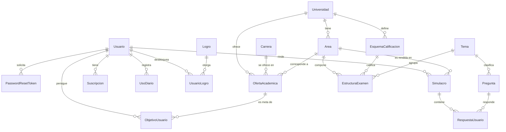

# RumboU — Plataforma de preparación para el examen de admisión (UNI y UNMSM)

- **Curso:** CS2031 Desarrollo Basado en Plataformas — UTEC, ciclo 2026-2
- **Entrega:** Proyecto 1 (Semana 7)
- **Integrantes:** Marco Bautista, Fabiana Gomez, Juan Carlos Vergara y Zoe Garrido Cantoni
- **API en producción (AWS):** http://184.194.122.22 ([health](http://184.194.122.22/api/v1/health))
- **Colección de Postman:** [`postman_collection.json`](postman_collection.json) · **Guía de uso:** [`GUIA-DE-USO.md`](GUIA-DE-USO.md)

## Índice

1. [Introducción](#1-introducción)
2. [Identificación del problema o necesidad](#2-identificación-del-problema-o-necesidad)
3. [Descripción de la solución](#3-descripción-de-la-solución)
4. [Modelo de entidades](#4-modelo-de-entidades)
5. [Manejo de errores](#5-manejo-de-errores)
6. [Medidas de seguridad implementadas](#6-medidas-de-seguridad-implementadas)
7. [Eventos y asincronía](#7-eventos-y-asincronía)
8. [GitHub y gestión del proyecto](#8-github-y-gestión-del-proyecto)
9. [Conclusión](#9-conclusión)
10. [Apéndices](#10-apéndices)

## 1. Introducción

### Contexto

En el Perú, el ingreso a universidades públicas como la UNI y la UNMSM se decide en un examen de admisión muy competitivo. Cada universidad, e incluso cada área, tiene su propia estructura de prueba, su penalidad por respuesta incorrecta y un puntaje de corte por carrera que cambia en cada proceso. Prepararse bien exige practicar con las reglas exactas del examen real y saber qué tan lejos se está del puntaje de ingreso.

RumboU es una API REST en Spring Boot que sirve de backend a una plataforma de preparación para estos exámenes (UNI, área General; UNMSM, áreas B y C). No incluye frontend: se demuestra desde la colección de Postman.

### Objetivos

- Rendir simulacros que repliquen el examen real de cada universidad y área: mismas preguntas por tema, mismo acierto y penalidad.
- Traducir el puntaje simulado en una medida de avance: el Puntaje Simulado Proyectado (PSP) y el Índice de Progreso (IP) respecto al último ingresante de la carrera objetivo.
- Mantener un banco de preguntas propio, generado con IA y revisado por una persona.
- Incentivar la constancia con racha, XP y logros.
- Sostener el servicio con un modelo freemium: plan gratuito con límites y plan PRO.

## 2. Identificación del problema o necesidad

### Descripción del problema

Los postulantes se preparan con material genérico que no refleja la estructura de puntaje de su universidad: una misma pregunta vale y penaliza distinto en la UNI y en la UNMSM. Tampoco hay una forma clara de traducir un puntaje simulado a "qué tan cerca estoy de ingresar a mi carrera", porque eso depende del puntaje del último ingresante, que cambia cada proceso.

### Justificación

Una preparación de calidad suele estar limitada a quienes pueden pagar una academia. Modelar las reglas de cada examen como datos configurables, y no como código, permite llegar a más personas y hace que agregar otra universidad sea un cambio de datos, no de arquitectura. Esa es la regla central del proyecto: ningún puntaje, penalidad ni corte de admisión vive en el código.

## 3. Descripción de la solución

### Funcionalidades implementadas

- **Autenticación y roles:** registro, login, JWT con el rol embebido, refresh tokens, recuperación de contraseña de un solo uso y administración de roles `USER`/`ADMIN`.
- **Motor de simulacros:** `COMPLETO` y `DIAGNOSTICO` arman el examen entero del área; `POR_TEMA`, solo las preguntas de un tema con la cantidad del examen real. Califica con la penalidad del esquema y calcula el PSP.
- **Progreso:** carreras objetivo con PSP, IP y semáforo (holgado, ajustado, cerca, reforzar), dominio por tema e historial de PSP.
- **Banco de preguntas:** CRUD por rol, filtros paginados y generación con Gemini con validación automática y aprobación humana. **792 preguntas aprobadas** (36 por tema en 22 temas): alcanzan para los exámenes completos de la UNI (180) y la UNMSM (100).
- **Catálogo académico:** universidades, áreas, esquemas, temas, estructura del examen, 51 carreras y 70 ofertas con puntaje de ingreso, cargados desde CSV con un seed idempotente.
- **Suscripción PRO:** `PlanService` como puerta única de límites, pago por Mercado Pago, webhook idempotente, activación por evento y job diario de vencimientos.
- **Tutor de IA** (PRO, con tope diario) y explicación estática por pregunta fallada; **gamificación** con racha, XP y logros; **correo** de registro, recuperación y pago con plantillas Thymeleaf asíncronas.
- **Despliegue en la nube:** la API corre en una instancia **EC2** contra **RDS PostgreSQL**, con el servicio administrado por systemd y nginx como proxy inverso.

### Tecnologías utilizadas

Java 21, Spring Boot 3.3.5 y Maven · Spring Data JPA, Hibernate y PostgreSQL 16 · Spring Security con JWT (access y refresh) y BCrypt · Google Gemini, Mercado Pago y JavaMailSender + Thymeleaf · JUnit 5, Mockito, MockMvc, Testcontainers y GitHub Actions · Docker, AWS (EC2 y RDS) y Postman.

### Arquitectura y patrones

El código está organizado **por capas**; una petición las atraviesa en orden.

```text
controller/ (32 endpoints) -> service/ -> repository/ -> entity/ (18)   |   event/ (5) + listener/ (7)
dto/ (13 request, 20 response) · mapper/ (6) · exception/ (14 + handler) · security/ · client/ · seed/ · scheduler/
```

Patrones: inyección por constructor; Repository con Spring Data; **mappers** (`mapper/`) que concentran la conversión entidad → DTO; controllers sin lógica que obtienen al usuario del `SecurityContext` a través de `CurrentUserService` dentro de los servicios; **DTOs especializados por caso de uso** (`PreguntaResponse` oculta la clave al postulante, `PreguntaAdminResponse` la incluye), de modo que ningún endpoint recibe ni devuelve entidades; Bean Validation con `@Valid`; arquitectura dirigida por eventos; y un **motor de calificación dirigido por datos**: `CalificadorService` recibe el esquema como parámetro y no tiene un condicional por universidad.

## 4. Modelo de entidades

### Diagrama



### Descripción

Son 18 entidades JPA con `id` heredado de `BaseEntity`; los enums se persisten como texto (`EnumType.STRING`). `PagoWebhook` no se relaciona con otras: registra los pagos ya procesados.

| Grupo | Entidades | Qué representan |
| --- | --- | --- |
| Autenticación | `Usuario`, `PasswordResetToken` | Cuenta con rol, racha y XP (`@Version`); token de un solo uso para recuperar la contraseña |
| Académico | `Universidad`, `Area`, `Carrera`, `OfertaAcademica`, `EsquemaCalificacion`, `Tema`, `EstructuraExamen` | Catálogo y reglas del examen como datos: temas por área, cantidad de preguntas, acierto, penalidad y máximo |
| Contenido | `Pregunta` | Pertenece a un tema, no a una universidad: el mismo banco sirve para ambas |
| Examen | `Simulacro`, `RespuestaUsuario` | El intento y cada respuesta con su puntaje aportado, que puede ser negativo |
| Progreso | `ObjetivoUsuario` | Carrera objetivo con el último PSP e IP; se desactiva, no se borra |
| Suscripción | `Suscripcion`, `UsoDiario`, `PagoWebhook` | Plan, contadores diarios (`@Version`) y pagos ya procesados (idempotencia) |
| Gamificación | `Logro`, `UsuarioLogro` | Catálogo de logros y cuáles desbloqueó cada usuario |

`OfertaAcademica` (universidad + carrera + área + proceso, con el puntaje del último ingresante) y `RespuestaUsuario` son relaciones M:N con atributos propios.

## 5. Manejo de errores

Todos los errores se resuelven en un único `@RestControllerAdvice` (`GlobalExceptionHandler`), sin `try/catch` en los controllers. La respuesta siempre es un `ErrorResponse` (`timestamp`, `status`, `error`, `message`, `path`). Excepciones propias, por categoría:

Todas heredan de `ApiException`, que lleva su código HTTP; el handler las atiende con un solo método.

- Recurso: `ResourceNotFoundException` (404); conflictos (`ConflictException`, 409): `DuplicateResourceException` y `ResourceInUseException` (p. ej. borrar una pregunta que ya salió en un simulacro).
- Autenticación (`AuthenticationFailedException`, 401): `InvalidCredentialsException`, `InvalidTokenException` e `InvalidWebhookSignatureException`.
- Autorización: `ForbiddenException` (403) y su subclase `PlanLimitExceededException` para los límites del plan.
- Reglas de negocio: `InvalidOperationException` (400).
- Servicios externos: `ExternalServiceException` y `GeminiException` (502).

El handler cubre también las de Spring: `BadCredentialsException` (401), `AccessDeniedException` (403, cuando `@PreAuthorize` rechaza el rol), `MethodArgumentNotValidException` (400, detalle de `@Valid`), `HttpMessageNotReadableException` (400, JSON mal formado), `ConstraintViolationException` (400), parámetros o headers ausentes o inválidos (400), JWT inválido (401), método no permitido (405), media type no soportado (415), `DataIntegrityViolationException` y bloqueo optimista (409), `NoResourceFoundException` (404) y un respaldo genérico (500) que registra el error en el log y responde un mensaje fijo, sin detalles internos.

## 6. Medidas de seguridad implementadas

### Seguridad de datos

- **Contraseñas** hasheadas con `BCryptPasswordEncoder`; ningún DTO de respuesta incluye el hash.
- **JWT stateless:** access token de 15 minutos y refresh token de 7 días, firmados con una clave HMAC que viene de `JWT_SECRET`. El token lleva `userId` y `role`; el rol vive en la base de datos. El filtro solo acepta access tokens: un refresh token no sirve como Bearer, y un refresh inválido o expirado responde 401.
- **Autorización por método:** `@PreAuthorize("hasRole('ADMIN')")` con `@EnableMethodSecurity` sobre gestión de preguntas, búsqueda de usuarios y cambio de roles. Los servicios protegidos leen al usuario del `SecurityContext` con `CurrentUserService` y verifican que sea dueño del recurso (403 si no). Los límites del plan se verifican en `PlanService`; el `ADMIN` los pasa todos.
- **Administradores controlados:** el registro público solo crea `USER`; el primer `ADMIN` nace de `ADMIN_EMAIL`/`ADMIN_PASSWORD` al arrancar, solo un administrador promueve a otros y ninguno se quita su propio rol.
- **Contraseñas robustas:** registro y reseteo exigen 8 a 72 caracteres con mayúscula, minúscula y número (`@Pattern`); el email se guarda en minúsculas y es único sin distinguir mayúsculas.
- **Webhook firmado:** con `MP_WEBHOOK_SECRET` configurado, cada notificación de Mercado Pago debe traer una firma `x-signature` (HMAC-SHA256) válida; si no, 401 y no se activa ningún plan.
- **Recuperación de contraseña:** token de un solo uso, 30 minutos de vigencia, invalida los anteriores; el endpoint responde igual exista o no el correo.
- **Secretos fuera del repositorio:** base de datos, JWT, Gemini, Mercado Pago y SMTP vienen de variables de entorno.

### Prevención de vulnerabilidades

- **Inyección SQL:** todas las consultas pasan por Spring Data JPA / Hibernate con parámetros; ninguna se concatena.
- **XSS:** la API solo devuelve JSON y nunca renderiza HTML con datos del usuario; toda entrada pasa por Bean Validation.
- **CSRF:** desactivado porque la API es stateless y no usa cookies; la autenticación es por header `Authorization: Bearer`.
- **CORS:** explícito en `SecurityConfig`; los orígenes permitidos vienen de `CORS_ALLOWED_ORIGINS` (abierto por defecto en desarrollo).

## 7. Eventos y asincronía

Los módulos no se llaman entre sí: se comunican con eventos (`ApplicationEventPublisher`), lo que permitió avanzar en paralelo y los mantiene desacoplados.

| Evento | Lo publica | Lo escucha | Modo |
| --- | --- | --- | --- |
| `SimulacroFinalizadoEvent` | `SimulacroService` | `GamificacionListener` (racha, XP, logros), `ProgresoListener` (PSP e IP) | Síncrono, misma transacción |
| `RespuestaIncorrectaEvent` | `SimulacroService` | `TutorIaExplicacionListener` (cachea una explicación) | `@Async` + `AFTER_COMMIT` |
| `PagoAprobadoEvent` | `WebhookService` | `SuscripcionActivacionListener`, `PagoAprobadoCorreoListener` | `AFTER_COMMIT` |
| `PasswordResetRequestedEvent` | `AuthService` | `RecuperacionContrasenaCorreoListener` (correo) | `@Async` + `AFTER_COMMIT` |
| `UsuarioRegistradoEvent` | `AuthService` | `RegistroConfirmacionListener` (correo) | `@Async` + `AFTER_COMMIT` |

Los oyentes que llaman a un tercero (Gemini, SMTP) son `@Async` sobre un pool propio, así la respuesta HTTP no espera. Los que dependen de datos recién escritos usan `AFTER_COMMIT` y, si escriben, abren su propia transacción con `REQUIRES_NEW`, porque en esa fase la original ya se cerró. `SuscripcionVencimientoJob` (`@Scheduled`, 3 a.m.) vence las suscripciones cuya fecha de fin pasó.

## 8. GitHub y gestión del proyecto

- **Flujo de trabajo:** `main` protegida, una rama por funcionalidad y merge solo por pull request: 35 integrados, todos con el CI en verde.
- **Integración continua:** [`.github/workflows/ci.yml`](.github/workflows/ci.yml) ejecuta `mvnw verify` en cada push y pull request: 244 pruebas en 36 clases (unitarias, `@WebMvcTest`, repositorio y seed contra PostgreSQL real con Testcontainers, y una prueba de humo que levanta la aplicación completa).
- **Issues, labels y milestone:** más de 20 issues en el milestone "Entrega Semana 7", con labels por módulo (`auth`, `examen`, `contenido`, `academico`, `progreso`, `suscripcion`, `gamificacion`, `correo`, `seed`, `deployment`), por tipo (`rubrica`, `bug`, `seguridad`, `testing`, `documentation`) y de proceso (`Permiso común`, `Coordinar con Marco`). Los avisos y decisiones de diseño se discutieron en issues.
- **Reparto:** Marco (autenticación, examen, banco de preguntas), Juan Carlos (catálogo académico, progreso), Zoe (suscripción, gamificación, correo) y Fabiana (contenido, primera etapa). Cada persona responde por sus clases.

## 9. Conclusión

### Logros

La API cubre de punta a punta el flujo del postulante: registrarse, elegir una carrera objetivo, rendir un simulacro con la estructura y calificación reales de su universidad, ver su PSP e IP, acumular racha y XP, y pasar a PRO para usar el tutor de IA. El banco tiene 792 preguntas aprobadas por una persona, las 244 pruebas corren en cada pull request y el sistema está desplegado con base de datos en la nube.

### Aprendizajes

- Modelar las reglas del examen como datos permitió soportar dos universidades sin un condicional por universidad.
- `@TransactionalEventListener(AFTER_COMMIT)` no se combina con `@Transactional` por defecto; la solución (`REQUIRES_NEW`) quedó documentada en el código.
- Un CI en verde no garantiza que la aplicación arranque: los tests por rebanada no cargan el contexto completo; una prueba de humo con `@SpringBootTest` cerró ese hueco.
- Probar de punta a punta contra la base real destapó lo que los mocks no ven: un simulacro por tema que devolvía el examen completo y una consulta JPQL que fallaba con un parámetro nulo.

### Trabajo futuro

- Servir la API por HTTPS con un dominio propio y fijar `CORS_ALLOWED_ORIGINS` al dominio del frontend.
- Sumar universidades como cambio de datos y ampliar la gamificación con ligas semanales.

## 10. Apéndices

### A. Instalación y ejecución local

**Requisitos:** Java 21, Docker Desktop y el Maven Wrapper incluido.

1. **Base de datos:** `docker compose up -d` levanta PostgreSQL en el puerto **5433** (no el 5432, para no chocar con instalaciones nativas).
2. **Datos:** `./mvnw spring-boot:run "-Dspring-boot.run.profiles=seed"` carga desde `src/main/resources/seed/` todo el catálogo y las 792 preguntas. Es idempotente.
3. **Aplicación:** `./mvnw spring-boot:run` en `http://localhost:8080`.
4. **Pruebas:** `./mvnw test` con Docker abierto (Testcontainers).

Variables de entorno (con valor por defecto de desarrollo; ninguna credencial real en el repositorio): `SPRING_DATASOURCE_*`, `JWT_SECRET`, `PORT`, `ADMIN_EMAIL`, `ADMIN_PASSWORD`, `GEMINI_API_KEY`, `MP_ACCESS_TOKEN`, `MP_WEBHOOK_SECRET`, `CORS_ALLOWED_ORIGINS`, `APP_RESET_PASSWORD_URL`, `SHOW_SQL` y `MAIL_*`. Sin Gemini, Mercado Pago ni correo la aplicación arranca igual y esas funciones responden 502. Para ampliar el banco: profile `generar-preguntas`, aprobación por la API y profile `exportar-preguntas`.

### B. Despliegue

La API corre en **AWS**: una instancia **EC2** (Amazon Linux 2023, Java 21) ejecuta el jar como servicio de systemd detrás de **nginx**, y los datos viven en **RDS PostgreSQL 16**, cuyo grupo de seguridad solo acepta conexiones desde el de la instancia. La configuración llega por variables de entorno fuera del repositorio y el seed se ejecuta con `SPRING_PROFILES_ACTIVE=seed`. El [Dockerfile](Dockerfile) mantiene la imagen portable a otro proveedor.

### C. Referencia de la API y colección de Postman

Rutas bajo `/api/v1`, recursos en plural. 🔒 requiere token; 👑 además rol `ADMIN`.

| Recurso | Endpoints |
| --- | --- |
| Sistema | `GET /health` (público) |
| Autenticación | `POST /auth/register`, `/auth/login`, `/auth/refresh`, `/auth/forgot-password`, `/auth/reset-password` |
| Usuarios | 🔒 `GET /usuarios/me` · `GET /usuarios/me/gamificacion` · 👑 `GET /usuarios?email=` · 👑 `PATCH /usuarios/{id}/rol` |
| Catálogo | 🔒 `GET /ofertas-academicas?universidad=&area=&carrera=` |
| Simulacros | 🔒 `POST /simulacros` (`COMPLETO`, `DIAGNOSTICO` o `POR_TEMA` + `temaId`) · `GET /simulacros` (paginado) · `GET /simulacros/{id}` (corrección al finalizar) · `POST /simulacros/{id}/respuestas` · `POST /simulacros/{id}/finalizar` |
| Progreso | 🔒 `POST /objetivos` · `GET /objetivos` · `DELETE /objetivos/{id}` · `GET /progreso/dominio-temas` (PRO) · `GET /progreso/historial?areaId=` (PRO) |
| Preguntas | 🔒 `GET /preguntas` (filtros, paginación) · `GET /preguntas/{id}` · `POST /preguntas/{id}/tutor-ia` (PRO) · 👑 `POST`, `PUT /{id}`, `PATCH /{id}/aprobar`, `PATCH /aprobar-lote`, `DELETE /{id}` |
| Suscripciones | 🔒 `POST /suscripciones` · `GET /suscripciones/me` · `POST /webhooks/mercadopago` (público, firmado, idempotente) |

La colección [`postman_collection.json`](postman_collection.json) documenta cada request con descripción, ejemplo y validaciones, y se ejecuta completa en orden: `baseUrl` apunta a producción, el registro genera un email nuevo por corrida, la autorización Bearer está a nivel de colección y los scripts guardan tokens e ids. "Login como administrador" trae la **cuenta de evaluación** del curso (`evaluador@rumbou.app`, rol `ADMIN`) para probar los endpoints de administración.

### D. Licencia

Proyecto académico para el curso CS2031 Desarrollo Basado en Plataformas (UTEC); su uso está restringido al contexto del curso y no cuenta con licencia de código abierto.

### E. Referencias

- Spring Boot, Security y Data JPA — [spring.io](https://spring.io/projects) · Testcontainers — [testcontainers.com](https://testcontainers.com)
- API de Gemini — [ai.google.dev/gemini-api/docs](https://ai.google.dev/gemini-api/docs) · Mercado Pago — [mercadopago.com.pe/developers](https://www.mercadopago.com.pe/developers)
- Prospectos de admisión de la UNI y la UNMSM (estructura del examen, esquemas de calificación y puntajes por carrera).
