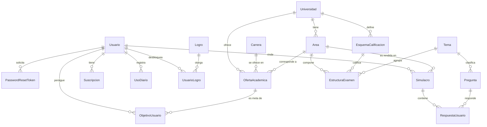

# RumboU — Plataforma de preparación para el examen de admisión (UNI y UNMSM)

- **Curso:** CS2031 Desarrollo Basado en Plataformas — UTEC, ciclo 2026-2
- **Entrega:** Proyecto 1 (Semana 7)
- **Integrantes:** Marco Bautista, Fabiana Gomez, Juan Carlos Vergara y Zoe Garrido Cantoni
- **API en producción (AWS):** http://184.194.122.22 ([health](http://184.194.122.22/api/v1/health))
- **Colección de Postman:** [`postman_collection.json`](postman_collection.json) · **Guía de uso detallada:** [`GUIA-DE-USO.md`](GUIA-DE-USO.md)

## Índice

1. [Introducción](#1-introducción)
2. [Identificación del problema o necesidad](#2-identificación-del-problema-o-necesidad)
3. [Descripción de la solución](#3-descripción-de-la-solución)
4. [Modelo de entidades](#4-modelo-de-entidades)
5. [Manejo de errores](#5-manejo-de-errores)
6. [Medidas de seguridad implementadas](#6-medidas-de-seguridad-implementadas)
7. [Eventos y asincronía](#7-eventos-y-asincronía)
8. [GitHub y gestión del proyecto](#8-github-y-gestión-del-proyecto)
9. [Conclusión](#9-conclusión)
10. [Apéndices](#10-apéndices)

## 1. Introducción

### Contexto

En el Perú, el ingreso a la UNI y la UNMSM se decide en un examen muy competitivo. Cada universidad y área tiene su propia estructura de prueba, su penalidad por respuesta incorrecta y un puntaje de corte por carrera que cambia en cada proceso. RumboU es una API REST en Spring Boot para prepararse con esas reglas exactas (UNI área General; UNMSM áreas B y C). No incluye frontend: se demuestra con Postman.

### Objetivos

- Rendir simulacros que repliquen el examen real: mismas preguntas por tema, mismo acierto y penalidad.
- Traducir el puntaje en avance: Puntaje Simulado Proyectado (PSP) e Índice de Progreso (IP) frente al último ingresante de la carrera objetivo.
- Mantener un banco de preguntas generado con IA y revisado por personas.
- Incentivar la constancia con racha, XP y logros, y sostener el servicio con un modelo freemium.

## 2. Identificación del problema o necesidad

### Descripción del problema

Los postulantes practican con material genérico que no refleja la calificación de su universidad: una misma pregunta vale y penaliza distinto en la UNI y en la UNMSM. Tampoco saben qué tan cerca están de ingresar, porque eso depende del puntaje del último ingresante, que cambia cada proceso.

### Justificación

Una preparación de calidad suele estar limitada a quien paga una academia. Modelar las reglas de cada examen como datos, y no como código, permite llegar a más personas y hace que agregar una universidad sea un cambio de datos, no de arquitectura.

## 3. Descripción de la solución

### Funcionalidades implementadas

- **Autenticación y roles:** registro, login, JWT con refresh token, recuperación de contraseña y tres roles: `USER`, `REVIEWER` (aprueba preguntas) y `ADMIN`.
- **Simulacros:** `COMPLETO`, `DIAGNOSTICO` y `POR_TEMA`; califican con la penalidad del esquema, calculan el PSP y, al finalizar, muestran la corrección con explicación.
- **Progreso:** carreras objetivo con PSP, IP y semáforo; dominio por tema e historial de PSP (PRO).
- **Banco de preguntas:** 792 preguntas aprobadas, filtros paginados, generación con Gemini y aprobación humana.
- **Catálogo académico:** universidades, áreas, esquemas, temas, 51 carreras y 70 ofertas, cargados desde CSV.
- **Suscripción PRO:** Mercado Pago, webhook firmado e idempotente, límites centralizados en `PlanService` y vencimiento diario.
- **Tutor de IA** (PRO), **gamificación** (racha, XP y logros) y **correos** HTML con Thymeleaf.

### Tecnologías utilizadas

Java 21, Spring Boot 3.3.5, Maven · Spring Data JPA, Hibernate, PostgreSQL 16 · Spring Security, JWT (jjwt), BCrypt · Google Gemini, Mercado Pago, JavaMailSender + Thymeleaf · JUnit 5, Mockito, MockMvc, Testcontainers · GitHub Actions, Docker, AWS (EC2 + RDS), Postman.

### Arquitectura

```mermaid
flowchart LR
    C[Cliente / Postman] -->|JWT Bearer| F[JwtAuthenticationFilter]
    F --> CT[Controllers]
    CT --> S[Servicios: interfaces + impl]
    S --> M[Mappers]
    S --> R[Repositories]
    R --> DB[(PostgreSQL / RDS)]
    S -->|publica| E[Eventos]
    E --> L[Listeners]
    L -->|@Async| X[Gemini · SMTP]
    S --> MP[Mercado Pago]
```

Cada controller solo delega en una interfaz de servicio (`service/`), implementada en `service/impl/`. Los servicios obtienen al usuario del `SecurityContext` con `CurrentUserService`, convierten entidades a DTOs con `mapper/` y nunca exponen entidades.

### Decisiones de diseño

- **Reglas como datos:** `CalificadorService` recibe el esquema como parámetro; no hay un condicional por universidad.
- **Acciones de dominio como subrecursos:** `POST /simulacros/{id}/finalizar` y `PATCH /preguntas/{id}/aprobar` no son actualizaciones de campos, sino transiciones con reglas (calificar, publicar eventos). Modelarlas como `PATCH {estado}` escondería esa lógica.
- **Sin HATEOAS:** la API la consume un cliente propio que conoce sus rutas; los ids que encadenan el flujo (`simulacroId`, `preguntaId`, `areaId`) vienen en cada respuesta.
- **Interfaces solo donde hay contrato:** los servicios que usan controllers y listeners tienen interfaz; los auxiliares internos (`PlanService`, `CalificadorService`) no.

## 4. Modelo de entidades

### Diagrama



### Descripción

18 entidades JPA con `id` heredado de `BaseEntity`. Todas las relaciones `@ManyToOne` son `LAZY`; `Simulacro → RespuestaUsuario` y `Usuario → UsuarioLogro / PasswordResetToken` son `@OneToMany` con `cascade` y `orphanRemoval`, porque esos hijos no existen sin su padre. Hay índices en las columnas más consultadas y `@UniqueConstraint` donde el negocio lo exige.

| Grupo | Entidades | Qué representan |
| --- | --- | --- |
| Autenticación | `Usuario`, `PasswordResetToken` | Cuenta con rol, racha y XP; token de reseteo de un solo uso |
| Académico | `Universidad`, `Area`, `Carrera`, `OfertaAcademica`, `EsquemaCalificacion`, `Tema`, `EstructuraExamen` | Reglas del examen como datos: preguntas por tema, acierto, penalidad y corte |
| Contenido | `Pregunta` | Pertenece a un tema, no a una universidad: el banco sirve para ambas |
| Examen | `Simulacro`, `RespuestaUsuario` | El intento y cada respuesta con su puntaje, que puede ser negativo |
| Progreso | `ObjetivoUsuario` | Carrera objetivo con el último PSP e IP |
| Suscripción | `Suscripcion`, `UsoDiario`, `PagoWebhook` | Plan, contadores del plan gratuito y pagos procesados (idempotencia) |
| Gamificación | `Logro`, `UsuarioLogro` | Logros y cuáles desbloqueó cada usuario |

## 5. Manejo de errores

Un único `@RestControllerAdvice` responde siempre con `ErrorResponse` (`timestamp`, `status`, `error`, `message`, `path`). Las excepciones propias heredan de `ApiException`, que lleva su código HTTP:

- `ResourceNotFoundException` (404); `DuplicateResourceException` y `ResourceInUseException` (409).
- `InvalidCredentialsException`, `InvalidTokenException`, `InvalidWebhookSignatureException` (401).
- `ForbiddenException` y `PlanLimitExceededException` (403); `InvalidOperationException` (400).
- `ExternalServiceException` y `GeminiException` (502).

También cubre las de Spring y del framework: validación (400), JSON mal formado (400), JWT inválido (401), `@PreAuthorize` (403), método no permitido (405), media type (415), integridad de datos y bloqueo optimista (409). El 500 registra el error en el log y responde un mensaje fijo. Manejarlas así da respuestas consistentes y nunca expone trazas ni SQL.

## 6. Medidas de seguridad implementadas

### Seguridad de datos

- **Contraseñas** con BCrypt y política de fortaleza (`@Pattern`: mayúscula, minúscula y número).
- **JWT stateless:** access de 15 minutos y refresh de 7 días, con `userId` y `role`, firmados con `JWT_SECRET`. El refresh token no sirve como Bearer.
- **Autorización:** `@PreAuthorize` por rol (`ADMIN` gestiona preguntas y roles; `REVIEWER` aprueba) y verificación de dueño en los servicios mediante el `SecurityContext`.
- **Webhook firmado:** con `MP_WEBHOOK_SECRET`, Mercado Pago debe firmar cada notificación (HMAC-SHA256).
- **Secretos** solo en variables de entorno.

### Prevención de vulnerabilidades

- **Inyección SQL:** solo consultas parametrizadas con Spring Data JPA.
- **XSS:** la API devuelve JSON y valida toda entrada con Bean Validation.
- **CSRF:** desactivado porque la API es stateless y no usa cookies.
- **CORS:** orígenes configurables con `CORS_ALLOWED_ORIGINS`.

## 7. Eventos y asincronía

| Evento | Lo publica | Lo escucha | Modo |
| --- | --- | --- | --- |
| `SimulacroFinalizadoEvent` | `SimulacroService` | `GamificacionListener`, `ProgresoListener` | Síncrono, misma transacción |
| `RespuestaIncorrectaEvent` | `SimulacroService` | `TutorIaExplicacionListener` (Gemini) | `@Async` + `AFTER_COMMIT` |
| `PagoAprobadoEvent` | `WebhookService` | `SuscripcionActivacionListener`, `PagoAprobadoCorreoListener` | `AFTER_COMMIT` (correo `@Async`) |
| `PasswordResetRequestedEvent` | `AuthService` | `RecuperacionContrasenaCorreoListener` | `@Async` + `AFTER_COMMIT` |
| `UsuarioRegistradoEvent` | `AuthService` | `RegistroConfirmacionListener` | `@Async` + `AFTER_COMMIT` |

Los eventos desacoplan los módulos: el simulacro no conoce la gamificación ni el correo. Lo que llama a un tercero (Gemini, SMTP) es asíncrono sobre un `ThreadPoolTaskExecutor` propio, para que la respuesta HTTP no espere a un servicio lento o caído. Lo que depende de datos recién guardados usa `AFTER_COMMIT`.

## 8. GitHub y gestión del proyecto

- **Flujo:** `main` protegida, una rama por funcionalidad y merge solo por pull request con el CI en verde.
- **GitHub Actions:** [`ci.yml`](.github/workflows/ci.yml) ejecuta `mvnw verify` en cada push y PR: 250 pruebas unitarias, de controller, de repositorio con Testcontainers y una prueba de humo del contexto completo.
- **Issues:** milestone "Entrega Semana 7", labels por módulo, tipo y proceso, y responsables asignados.
- **Reparto:** Marco (autenticación, examen, preguntas), Juan Carlos (catálogo, progreso), Zoe (suscripción, gamificación, correo) y Fabiana (contenido, revisión de rúbrica).

## 9. Conclusión

### Logros

La API cubre el flujo completo del postulante: registrarse, elegir una carrera, rendir un simulacro con las reglas reales, revisar su corrección, ver su PSP e IP, acumular XP y pasar a PRO. Tiene 792 preguntas revisadas y está desplegada en AWS.

### Aprendizajes clave

- Modelar las reglas como datos permitió soportar dos universidades sin condicionales.
- `AFTER_COMMIT` exige abrir una transacción nueva (`REQUIRES_NEW`) para escribir.
- Un CI en verde no garantiza que la aplicación arranque: la prueba de humo con `@SpringBootTest` cerró ese hueco.
- Probar contra PostgreSQL real destapó errores que los mocks no ven.

### Trabajo futuro

- HTTPS con dominio propio y CORS restringido al frontend.
- Más universidades como cambio de datos y ligas semanales de gamificación.

## 10. Apéndices

### A. Ejecución local

Requisitos: Java 21 y Docker.

1. `docker compose up -d` levanta PostgreSQL en el puerto 5433.
2. `./mvnw spring-boot:run "-Dspring-boot.run.profiles=seed"` carga el catálogo y las preguntas.
3. `./mvnw spring-boot:run` levanta la API en `http://localhost:8080`; `./mvnw test` corre las pruebas.

Variables de entorno: `SPRING_DATASOURCE_*`, `JWT_SECRET`, `ADMIN_EMAIL`, `ADMIN_PASSWORD`, `GEMINI_API_KEY`, `MP_ACCESS_TOKEN`, `MP_WEBHOOK_SECRET`, `CORS_ALLOWED_ORIGINS`, `APP_RESET_PASSWORD_URL`, `SHOW_SQL` y `MAIL_*`.

### B. Despliegue

Una instancia **EC2** ejecuta el jar con systemd detrás de nginx; los datos viven en **RDS PostgreSQL 16**, cuyo security group solo acepta a la instancia. La configuración llega por variables de entorno.

### C. Endpoints

Rutas bajo `/api/v1`. 🔒 requiere token; 🛡️ `ADMIN` o `REVIEWER`; 👑 solo `ADMIN`.

| Recurso | Endpoints |
| --- | --- |
| Sistema | `GET /health` |
| Autenticación | `POST /auth/register`, `/login`, `/refresh`, `/forgot-password`, `/reset-password` |
| Usuarios | 🔒 `GET /usuarios/me`, `GET /usuarios/me/gamificacion` · 👑 `GET /usuarios?email=`, `PATCH /usuarios/{id}/rol` |
| Catálogo | 🔒 `GET /ofertas-academicas` |
| Simulacros | 🔒 `POST /simulacros`, `GET /simulacros`, `GET /simulacros/{id}`, `POST /simulacros/{id}/respuestas`, `POST /simulacros/{id}/finalizar` |
| Progreso | 🔒 `POST /objetivos`, `GET /objetivos`, `DELETE /objetivos/{id}`, `GET /progreso/dominio-temas`, `GET /progreso/historial` |
| Preguntas | 🔒 `GET /preguntas`, `GET /preguntas/{id}`, `POST /preguntas/{id}/tutor-ia` · 🛡️ `PATCH /preguntas/{id}/aprobar`, `PATCH /preguntas/aprobar-lote` · 👑 `POST`, `PUT`, `DELETE /preguntas` |
| Suscripciones | 🔒 `POST /suscripciones`, `GET /suscripciones/me` · `POST /webhooks/mercadopago` (público, firmado) |

Cada request está documentado con ejemplos en la colección de Postman y explicado en la [guía de uso](GUIA-DE-USO.md).

### D. Licencia

Proyecto académico del curso CS2031 (UTEC); uso restringido al curso, sin licencia de código abierto.

### E. Referencias

- Spring Boot, Security y Data JPA — [spring.io](https://spring.io/projects) · Testcontainers — [testcontainers.com](https://testcontainers.com)
- Gemini — [ai.google.dev](https://ai.google.dev/gemini-api/docs) · Mercado Pago — [mercadopago.com.pe/developers](https://www.mercadopago.com.pe/developers)
- Prospectos de admisión de la UNI y la UNMSM.
