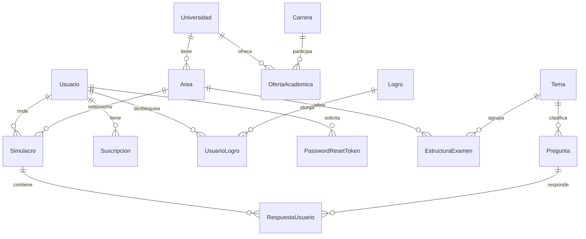

# RumboU - Plataforma de preparación para el examen de admisión

- **Curso:** CS2031 Desarrollo Basado en Plataformas - UTEC, ciclo 2026-2
- **Entrega:** Proyecto 1 (Semana 7)
- **Integrantes:** Marco Bautista, Fabiana Gomez, Juan Carlos Vergara y Zoe Garrido Cantoni
- **API en producción:** https://rumbou-backend-production.up.railway.app
- **Health check:** https://rumbou-backend-production.up.railway.app/api/v1/health
- **Colección de Postman:** [`postman_collection.json`](postman_collection.json)

RumboU es una API REST construida con Spring Boot para preparar postulantes a los exámenes de admisión de la UNI y la UNMSM. El proyecto modela las reglas de cada examen como datos configurables: estructura por tema, puntaje por respuesta correcta, penalidad y puntaje de referencia por carrera. Así, el backend puede generar y calificar simulacros sin tener lógica condicionada a una universidad específica.

## Problema y solución

Los postulantes suelen practicar con material genérico, aunque la UNI y la UNMSM tienen estructuras, penalidades y puntajes de ingreso distintos. Esto dificulta estimar cuánto representa un resultado de práctica frente a la carrera elegida. RumboU ofrece un banco de preguntas, simulacros configurados por área, cálculo de puntaje y funcionalidades de progreso, gamificación y suscripción.

El flujo principal es: una persona se registra, inicia sesión, elige un área y crea un simulacro; responde las preguntas y lo finaliza. El sistema califica las respuestas usando el esquema correspondiente, registra el resultado y publica eventos para actualizar racha, XP, logros y explicaciones de preguntas falladas. Los usuarios administradores pueden gestionar el banco de preguntas y las cuentas.

## Tecnologías

| Área | Tecnologías |
| --- | --- |
| Backend | Java 21, Spring Boot 3.3.5, Maven |
| Persistencia | Spring Data JPA, Hibernate y PostgreSQL 16 |
| Seguridad | Spring Security, JWT y BCrypt |
| Validación y web | Bean Validation, Spring Web y MockMvc |
| Integraciones | Google Gemini, Mercado Pago, JavaMailSender y Thymeleaf |
| Calidad | JUnit 5, Mockito, Testcontainers y GitHub Actions |
| Contenedores y entrega | Docker, Docker Compose, Railway y Postman |

## Arquitectura, DTOs y patrones

La aplicación sigue una arquitectura por capas. Los controladores reciben HTTP y devuelven respuestas REST; los servicios contienen las reglas de negocio y las transacciones; los repositorios resuelven la persistencia mediante Spring Data JPA. Las entidades nunca se exponen directamente en la API.

```text
controller/  ->  service/  ->  repository/  ->  entity/
                    |
                    +-> event/ y listener/
                    +-> client/ (Gemini y Mercado Pago)
```

Los DTOs separan los contratos de entrada y salida. Por ejemplo, `PreguntaResponse` no devuelve la alternativa correcta para un postulante, mientras `PreguntaAdminResponse` sí puede hacerlo para la gestión administrativa. Los request DTOs declaran reglas como `@NotBlank`, `@Email`, `@Size`, `@Min`, `@Max` y `@NotNull`; los controladores aplican `@Valid` antes de entrar a la lógica de negocio. Los mapeos se realizan en los servicios, donde se resuelven las relaciones necesarias y se evita recibir o devolver entidades JPA.

Se aplican inyección de dependencias por constructor, Repository con Spring Data, DTOs por caso de uso, validación declarativa y arquitectura dirigida por eventos. `CalificadorService` es un ejemplo del enfoque dirigido por datos: recibe el esquema de calificación de un área y calcula el resultado sin condicionales por universidad.

## Modelo de entidades

El modelo contiene 17 entidades JPA y enums persistidos con `EnumType.STRING`, para que los datos permanezcan legibles y no dependan del orden de los valores en código. Las entidades heredan los campos comunes de `BaseEntity`; las restricciones relevantes se expresan con anotaciones JPA y constraints de base de datos. Las operaciones concurrentes sensibles, como el avance de usuario y los contadores de uso, usan `@Version` para bloqueo optimista.



| Grupo | Entidades principales | Responsabilidad |
| --- | --- | --- |
| Autenticación | `Usuario`, `PasswordResetToken` | Cuenta, roles y recuperación de contraseña |
| Académico | `Universidad`, `Area`, `Carrera`, `OfertaAcademica`, `EsquemaCalificacion`, `Tema`, `EstructuraExamen` | Reglas y catálogo de admisión |
| Examen | `Pregunta`, `Simulacro`, `RespuestaUsuario` | Banco, intento y calificación |
| Suscripción | `Suscripcion`, `UsoDiario`, `PagoWebhook` | Plan, límites e idempotencia de pagos |
| Gamificación | `Logro`, `UsuarioLogro` | XP, racha y logros desbloqueados |

`OfertaAcademica` representa la relación entre universidad, carrera y área, añadiendo el puntaje del último ingresante. `RespuestaUsuario` vincula un simulacro con una pregunta y conserva el puntaje aportado, incluso cuando es negativo por penalidad. Esta separación permite que las relaciones M:N tengan atributos propios y que el historial de resultados sea reproducible.

## Seguridad y manejo de errores

La API es stateless. Las contraseñas se almacenan con `BCryptPasswordEncoder` y los tokens JWT usan una clave HMAC obtenida desde `JWT_SECRET`. El access token expira en 15 minutos y el refresh token en 7 días. Las credenciales, claves de integración y datos de PostgreSQL se cargan mediante variables de entorno; no se versionan secretos reales.

El registro público crea únicamente cuentas `USER`. Los endpoints de administración usan `@PreAuthorize("hasRole('ADMIN')")` y `@EnableMethodSecurity`; el cambio de rol está limitado a administradores y una cuenta no puede quitarse su propio rol. La recuperación de contraseña emplea tokens de un solo uso con vencimiento de 30 minutos y responde de la misma manera aunque el correo no exista, evitando enumeración de cuentas.

Las consultas usan Spring Data JPA e Hibernate con parámetros, evitando SQL construido por concatenación. La API no renderiza HTML de entrada de usuarios y valida los requests. CSRF está deshabilitado porque no se usan cookies ni sesiones, sino el header `Authorization: Bearer <token>`. CORS está centralizado en `SecurityConfig`; antes de una publicación pública con frontend debe restringirse al dominio autorizado.

`GlobalExceptionHandler`, anotado con `@RestControllerAdvice`, centraliza las respuestas de error. Todas siguen el contrato `timestamp`, `status`, `error`, `message` y `path`. Maneja errores de validación, JSON inválido, acceso denegado y excepciones propias como `ResourceNotFoundException` (404), `DuplicateResourceException` (409), `InvalidCredentialsException` e `InvalidTokenException` (401), `UnauthorizedException` (403), `InvalidOperationException` (400) y `ExternalServiceException`/`GeminiException` (502). Un error no controlado devuelve 500 sin filtrar detalles internos.

## Eventos, asincronía y correo

La comunicación entre módulos se realiza con `ApplicationEventPublisher`, evitando que un servicio dependa directamente de otro. Los eventos de dominio principales son `SimulacroFinalizadoEvent`, `RespuestaIncorrectaEvent`, `PagoAprobadoEvent`, `PasswordResetRequestedEvent` y `UsuarioRegistradoEvent`.

Los listeners de correo y Gemini se ejecutan con `@Async` sobre el executor configurado en `AsyncConfig`, por lo que el usuario no espera una llamada SMTP o de IA para recibir la respuesta HTTP. Los eventos que necesitan datos ya confirmados usan `@TransactionalEventListener(phase = AFTER_COMMIT)`. El listener de suscripción activa el plan tras el webhook idempotente de Mercado Pago; otro listener envía el correo de confirmación. Un job programado revisa diariamente las suscripciones vencidas.

## API REST y Postman

Todas las rutas están versionadas bajo `/api/v1`, usan sustantivos en plural y devuelven códigos HTTP coherentes. `GET /api/v1/health` es público; el resto se protege según el rol y la operación. Las listas de preguntas aceptan filtros y paginación, con un límite de tamaño para evitar respuestas excesivas.

| Recurso | Operaciones destacadas |
| --- | --- |
| `auth` | Registro, login, refresh token y recuperación de contraseña |
| `usuarios` | Perfil propio, búsqueda y cambio de rol para `ADMIN` |
| `preguntas` | Listado paginado, consulta, CRUD y aprobación administrativa |
| `simulacros` | Crear, responder y finalizar simulacros |
| `suscripciones` | Crear preaprobación de pago para plan PRO |
| `webhooks/mercadopago` | Recibir y procesar pagos de forma idempotente |

La colección [`postman_collection.json`](postman_collection.json), ubicada en la raíz, incluye variables para producción y local (`baseUrl` y `baseUrlLocal`), autenticación Bearer a nivel de colección, ejemplos de requests y scripts que guardan tokens e identificadores necesarios para seguir el flujo. Puede importarse directamente en Postman.

## Calidad y trabajo colaborativo

El repositorio incluye 25 clases de prueba con JUnit 5, Mockito, MockMvc y Testcontainers: pruebas unitarias, de capa web, de persistencia/seed contra PostgreSQL y una prueba de humo del contexto de Spring. El workflow [`.github/workflows/ci.yml`](.github/workflows/ci.yml) ejecuta `./mvnw -B verify` en cada push y pull request hacia `main`.

El equipo trabajó con ramas por funcionalidad (`feat/`, `fix/`, `refactor/` y `chore/`) y pull requests integrados a `main`. Las issues y labels separan los módulos de autenticación, examen, contenido, catálogo académico, suscripción, gamificación, correo, seed, despliegue y documentación. Esta trazabilidad permite relacionar las tareas con cambios concretos del repositorio.

## Instalación y ejecución local

**Requisitos:** Java 21, Docker Desktop y el Maven Wrapper incluido.

1. Levantar PostgreSQL: `docker compose up -d`. El contenedor publica el puerto `5433` para no interferir con instalaciones locales en el 5432.
2. Cargar el catálogo y las preguntas: `./mvnw spring-boot:run "-Dspring-boot.run.profiles=seed"`. El seed lee `src/main/resources/seed/`, es idempotente y carga universidades, áreas, esquemas, temas, carreras, ofertas, logros y preguntas.
3. Ejecutar la API: `./mvnw spring-boot:run`. Queda disponible en `http://localhost:8080`.
4. Ejecutar pruebas: `./mvnw test` con Docker Desktop abierto para Testcontainers.

Las variables de producción son `SPRING_DATASOURCE_URL`, `SPRING_DATASOURCE_USERNAME`, `SPRING_DATASOURCE_PASSWORD`, `JWT_SECRET`, `ADMIN_EMAIL`, `ADMIN_PASSWORD`, `GEMINI_API_KEY`, `MP_ACCESS_TOKEN`, `MAIL_HOST`, `MAIL_PORT`, `MAIL_USERNAME` y `MAIL_PASSWORD`. `PORT` es inyectada por la plataforma de despliegue. Las funciones de Gemini, Mercado Pago y correo pueden permanecer sin configurar durante el desarrollo local; al invocarlas sin credenciales, la API responde con un error 502 controlado.

## Despliegue

La API está desplegada en Railway con PostgreSQL gestionado y red privada entre servicios. El [Dockerfile](Dockerfile) construye el JAR en una etapa de build y ejecuta una imagen final con Java 21. Cada merge a `main` produce un nuevo despliegue; la configuración se entrega mediante variables de entorno. La disponibilidad puede verificarse en el health check público indicado al inicio de este documento.

El contenedor es portable a AWS: la migración prevista es ejecutar la misma imagen en EC2 o ECS y usar RDS para PostgreSQL, manteniendo las variables de entorno. Esa migración queda como trabajo futuro para cumplir un despliegue AWS administrado.

## Alcance y siguientes pasos

El backend implementa autenticación, simulacros, banco de preguntas, seguridad por roles, eventos, correo, suscripción y despliegue continuo. El siguiente incremento es completar el índice de progreso y dominio por tema, agregar sus endpoints de panel, restringir CORS al dominio del frontend y migrar la infraestructura a AWS.

Proyecto académico para CS2031 Desarrollo Basado en Plataformas - UTEC.
