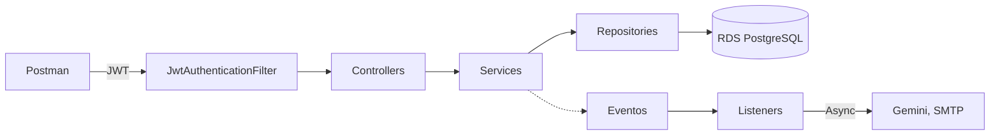
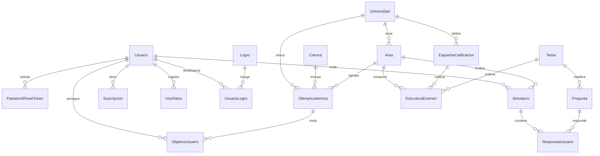

# RumboU — API para prepararse al examen de admisión de la UNI y la UNMSM

- **Curso:** CS 2031 Desarrollo Basado en Plataforma — UTEC, 2026-2 (Proyecto 1, Semana 7)
- **Integrantes:** Marco Emilio Bautista Ortega, Fabiana Gomez, Juan Carlos Alexander Vergara Montalván y Zoe Camila Garrido Cantoni
- **API desplegada en AWS:** http://184.194.122.22 ([health](http://184.194.122.22/api/v1/health))
- **Colección de Postman:** [`postman_collection.json`](postman_collection.json) · **Guía de uso detallada:** [`GUIA-DE-USO.md`](GUIA-DE-USO.md)

## Índice

1. [Introducción](#1-introducción)
2. [Identificación del problema o necesidad](#2-identificación-del-problema-o-necesidad)
3. [Descripción de la solución](#3-descripción-de-la-solución)
4. [Modelo de entidades](#4-modelo-de-entidades)
5. [Manejo de errores](#5-manejo-de-errores)
6. [Medidas de seguridad implementadas](#6-medidas-de-seguridad-implementadas)
7. [Eventos y asincronía](#7-eventos-y-asincronía)
8. [GitHub y gestión del proyecto](#8-github-y-gestión-del-proyecto)
9. [Conclusión](#9-conclusión)
10. [Apéndices](#10-apéndices)

## 1. Introducción

### Contexto

En el Perú, el ingreso a la UNI y a la UNMSM se decide en exámenes muy competitivos. Cada universidad y cada área tiene su propia estructura de prueba, su penalidad por respuesta incorrecta y un puntaje de corte por carrera que cambia en cada proceso. RumboU es una API REST en Spring Boot que sirve de backend a una plataforma de preparación para la UNI (área General) y la UNMSM (áreas B y C). No incluye frontend: se demuestra con Postman.

### Objetivos

- Rendir simulacros que repliquen el examen real de cada área, con el mismo acierto y penalidad.
- Traducir el puntaje en avance: Puntaje Simulado Proyectado (PSP) e Índice de Progreso (IP) frente al último ingresante de la carrera objetivo.
- Mantener un banco de preguntas propio, generado con IA y aprobado por una persona.
- Incentivar la constancia con racha, XP y logros, dentro de un modelo freemium.

## 2. Identificación del problema o necesidad

### Descripción del problema

Los postulantes practican con material genérico que no refleja la calificación de su universidad: una misma pregunta vale y penaliza distinto en la UNI y en la UNMSM. Tampoco saben qué tan cerca están de ingresar, porque eso depende del puntaje del último ingresante, que cambia en cada proceso.

### Justificación

Una buena preparación suele estar limitada a quienes pueden pagar una academia. Modelar las reglas de cada examen como datos, y no como código, abarata el servicio y convierte agregar una universidad en un cambio de datos, no de arquitectura.

## 3. Descripción de la solución

### Funcionalidades implementadas

- **Autenticación y roles:** registro, login, JWT, refresh tokens, recuperación de contraseña y roles `USER`/`ADMIN`.
- **Simulacros:** `COMPLETO` y `DIAGNOSTICO` arman el examen del área; `POR_TEMA`, un solo tema. Se califican con la penalidad real y producen el PSP.
- **Progreso:** carreras objetivo con PSP, IP y semáforo, dominio por tema e historial.
- **Banco de preguntas:** CRUD por rol con filtros y paginación; 792 preguntas generadas con Gemini y aprobadas, 36 por cada uno de los 22 temas.
- **Catálogo académico:** universidades, áreas, 51 carreras y 70 ofertas con puntaje de ingreso, cargados desde CSV.
- **Suscripción PRO:** límites centralizados en `PlanService`, pago con Mercado Pago y webhook firmado.
- **Tutor de IA**, **gamificación** y **correos HTML** de registro, recuperación y pago.

### Tecnologías utilizadas

Java 21, Spring Boot 3.3.5, Maven · Spring Data JPA, PostgreSQL 16 · Spring Security, JWT, BCrypt · Gemini, Mercado Pago, JavaMailSender, Thymeleaf · JUnit 5, Mockito, Testcontainers · GitHub Actions, Docker, AWS (EC2, RDS), Postman.

### Arquitectura y decisiones de diseño

- **Capas:** `controller → service → repository`. Los controllers validan y delegan; nunca acceden a repositorios.
- **DTOs y mappers:** 13 DTOs de entrada y 21 de salida; ningún endpoint expone entidades. `PreguntaResponse` oculta la clave al postulante y `PreguntaAdminResponse` la muestra.
- **Calificación dirigida por datos:** `CalificadorService` recibe el esquema como parámetro, sin condicionales por universidad.
- **REST:** rutas `/api/v1/...` en plural, códigos HTTP correctos y paginación. HATEOAS se evaluó y se descartó: sin frontend que navegue enlaces, bastan los ids y la colección documentada.

## 4. Modelo de entidades

### Diagrama

### Descripción

Son 18 entidades JPA con `@Entity`, `@Table` y `@Column`, e `id` heredado de `BaseEntity`. Las relaciones son `LAZY` y la base aplica restricciones `unique`, `nullable` e índices.

| Grupo | Entidades | Qué representan |
| --- | --- | --- |
| Autenticación | `Usuario`, `PasswordResetToken` | Cuenta con rol, racha y XP; token de recuperación |
| Académico | `Universidad`, `Area`, `Carrera`, `OfertaAcademica`, `EsquemaCalificacion`, `Tema`, `EstructuraExamen` | Reglas del examen como datos: preguntas por tema, acierto, penalidad y corte |
| Examen | `Pregunta`, `Simulacro`, `RespuestaUsuario` | Preguntas por tema; intentos y respuestas con su puntaje |
| Progreso | `ObjetivoUsuario` | Carrera objetivo con su PSP e IP |
| Suscripción | `Suscripcion`, `UsoDiario`, `PagoWebhook` | Plan, contadores con `@Version` y pagos procesados |
| Gamificación | `Logro`, `UsuarioLogro` | Logros desbloqueados |

`OfertaAcademica` y `RespuestaUsuario` son relaciones M:N con atributos propios.

## 5. Manejo de errores

Un `@RestControllerAdvice` (`GlobalExceptionHandler`) atiende todos los errores y responde siempre el mismo `ErrorResponse` (`timestamp`, `status`, `error`, `message`, `path`), sin `try/catch` en los controllers. Así el cliente recibe un formato predecible y nunca ve trazas internas.

Las 14 excepciones propias forman una jerarquía con raíz en `ApiException`, que lleva el código HTTP:

- **404:** `ResourceNotFoundException`. **409:** `DuplicateResourceException`, `ResourceInUseException`.
- **401:** `InvalidCredentialsException`, `InvalidTokenException`, `InvalidWebhookSignatureException`.
- **403:** `ForbiddenException`, `PlanLimitExceededException`. **400:** `InvalidOperationException`.
- **502:** `ExternalServiceException`, `GeminiException`.

También maneja las de Spring (`MethodArgumentNotValidException`, `HttpMessageNotReadableException`, `AccessDeniedException`, `DataIntegrityViolationException`) y un respaldo genérico (500) que registra el error sin exponer detalles.

## 6. Medidas de seguridad implementadas

### Seguridad de datos

- **Contraseñas:** BCrypt y política de 8 a 72 caracteres con mayúscula, minúscula y número.
- **JWT:** access token de 15 minutos y refresh de 7 días, firmados con `JWT_SECRET`, con email, `userId` y rol. `JwtAuthenticationFilter` valida firma y expiración; `UserDetailsServiceImpl` carga al usuario.
- **Roles:** en la base y en el token. `@PreAuthorize` con `@EnableMethodSecurity` protege la gestión de preguntas y usuarios, y los servicios verifican con el `SecurityContext` que el usuario sea dueño del recurso. El registro público solo crea `USER`.
- **Recuperación de contraseña:** token de un solo uso con 30 minutos de vigencia.
- **Webhook:** con `MP_WEBHOOK_SECRET` configurado, cada notificación de Mercado Pago debe traer una firma HMAC-SHA256 válida.
- **Secretos:** todos llegan por variables de entorno; ninguno está en el repositorio.

### Prevención de vulnerabilidades

- **Inyección SQL:** solo consultas parametrizadas de Spring Data JPA.
- **XSS:** la API responde JSON y valida toda entrada con Bean Validation.
- **CSRF:** desactivado porque la API es stateless y usa `Authorization: Bearer`, no cookies.
- **CORS:** configurado en `SecurityConfig` desde `CORS_ALLOWED_ORIGINS`.

## 7. Eventos y asincronía

| Evento | Lo publica | Lo escuchan | Modo |
| --- | --- | --- | --- |
| `SimulacroFinalizadoEvent` | `SimulacroService` | `GamificacionListener`, `ProgresoListener` | Síncrono |
| `RespuestaIncorrectaEvent` | `SimulacroService` | `TutorIaExplicacionListener` | `@Async`, `AFTER_COMMIT` |
| `PagoAprobadoEvent` | `WebhookService` | `SuscripcionActivacionListener`, `PagoAprobadoCorreoListener` | `AFTER_COMMIT` |
| `PasswordResetRequestedEvent` | `AuthService` | `RecuperacionContrasenaCorreoListener` | `@Async`, `AFTER_COMMIT` |
| `UsuarioRegistradoEvent` | `AuthService` | `RegistroConfirmacionListener` | `@Async`, `AFTER_COMMIT` |

Los módulos se comunican con eventos en lugar de llamarse entre sí, por eso el equipo pudo avanzar en paralelo. Los oyentes que llaman a terceros son `@Async` sobre un `ThreadPoolTaskExecutor` propio: la respuesta HTTP no espera a un servicio lento ni falla si este cae, y un correo fallido queda en el log. Los que leen datos recién escritos usan `AFTER_COMMIT`.

## 8. GitHub y gestión del proyecto

- **Tareas:** 23 issues con responsable en el milestone "Entrega Semana 7" y 26 labels por módulo, tipo y proceso; las decisiones se discutieron en los issues.
- **Flujo:** `main` protegida, una rama por funcionalidad y merge solo por pull request con el CI en verde: más de 40 integrados.
- **GitHub Actions:** [`ci.yml`](.github/workflows/ci.yml) ejecuta `mvnw verify` en cada push y pull request: 244 pruebas unitarias, web y de integración contra PostgreSQL real con Testcontainers.
- **Reparto:** Marco (autenticación, examen, preguntas y despliegue), Juan Carlos (catálogo y progreso), Zoe (suscripción, gamificación y correo) y Fabiana (contenido y ajustes finales).

## 9. Conclusión

### Logros

La API cubre el flujo completo del postulante: registrarse, elegir una carrera, rendir un simulacro con la calificación real de su universidad, ver su PSP e IP, sumar racha y XP, y pasar a PRO para usar el tutor de IA. Está desplegada en AWS, envía correos reales y la respaldan 244 pruebas.

### Aprendizajes

- Modelar las reglas del examen como datos permitió soportar dos universidades sin condicionales.
- Un oyente `AFTER_COMMIT` que escribe necesita `REQUIRES_NEW`.
- Un CI en verde no garantiza que la aplicación arranque; lo cubre una prueba de humo con `@SpringBootTest`.

### Trabajo futuro

HTTPS con dominio propio, un frontend web, más universidades y ligas semanales.

## 10. Apéndices

### A. Instalación y ejecución local

**Requisitos:** Java 21 o superior y Docker Desktop abierto. El Maven Wrapper viene incluido.

1. `docker compose up -d` levanta PostgreSQL en el puerto 5433.
2. La primera vez, `./mvnw spring-boot:run "-Dspring-boot.run.profiles=seed"` carga los datos y deja la API en `http://localhost:8080`. Después basta `./mvnw spring-boot:run`.
3. `./mvnw test` ejecuta las pruebas.

Para usar una cuenta `ADMIN` en local, arrancar con `ADMIN_EMAIL=evaluador@rumbou.app` y `ADMIN_PASSWORD=RumboU-Evaluador-2026`, los mismos de la colección.

**Variables de entorno:** `SPRING_DATASOURCE_*`, `JWT_SECRET`, `ADMIN_EMAIL`, `ADMIN_PASSWORD`, `GEMINI_API_KEY`, `MP_ACCESS_TOKEN`, `MP_WEBHOOK_SECRET`, `MP_BACK_URL`, `MP_TEST_PAYER_EMAIL`, `MAIL_*`, `CORS_ALLOWED_ORIGINS`, `APP_RESET_PASSWORD_URL` y `PORT`. Todas tienen valor de desarrollo; sin Gemini ni Mercado Pago esas funciones responden 502.

### B. Despliegue en AWS

Una instancia **EC2** ejecuta el jar como servicio de systemd detrás de **nginx**, con IP elástica, y los datos viven en **RDS PostgreSQL 16**. La base solo acepta conexiones desde el security group de la instancia, y las variables de entorno viven en el servidor, fuera del repositorio.

### C. Referencia de la API

Rutas bajo `/api/v1`; 🔒 requiere token y 👑 rol `ADMIN`. Detalle en [`GUIA-DE-USO.md`](GUIA-DE-USO.md).

| Recurso | Endpoints |
| --- | --- |
| Autenticación | `GET /health` · `POST /auth/register`, `/login`, `/refresh`, `/forgot-password`, `/reset-password` |
| Usuarios | 🔒 `GET /usuarios/me`, `/usuarios/me/gamificacion` · 👑 `GET /usuarios?email=`, `PATCH /usuarios/{id}/rol` |
| Catálogo | 🔒 `GET /ofertas-academicas` |
| Simulacros | 🔒 `POST /simulacros`, `GET /simulacros`, `GET /simulacros/{id}`, `POST /simulacros/{id}/respuestas`, `POST /simulacros/{id}/finalizar` |
| Progreso | 🔒 `POST /objetivos`, `GET /objetivos`, `DELETE /objetivos/{id}`, `GET /progreso/dominio-temas`, `GET /progreso/historial` |
| Preguntas | 🔒 `GET /preguntas`, `GET /preguntas/{id}`, `POST /preguntas/{id}/tutor-ia` · 👑 `POST`, `PUT`, `PATCH /aprobar`, `DELETE` |
| Suscripciones | 🔒 `POST /suscripciones`, `GET /suscripciones/me` · `POST /webhooks/mercadopago` |

La colección tiene 35 requests con descripción, ejemplo y tests, autorización Bearer a nivel de colección y variables que se llenan solas. Apunta a AWS e incluye la cuenta de evaluación `evaluador@rumbou.app` (`ADMIN`).

### D. Licencia

Proyecto académico del curso CS 2031 (UTEC). Todos los derechos reservados por sus autores.

### E. Referencias

- Spring — [spring.io](https://spring.io/projects) · Testcontainers — [testcontainers.com](https://testcontainers.com)
- Gemini — [ai.google.dev/gemini-api/docs](https://ai.google.dev/gemini-api/docs) · Mercado Pago — [mercadopago.com.pe/developers](https://www.mercadopago.com.pe/developers)
- Prospectos de admisión de la UNI y la UNMSM.
