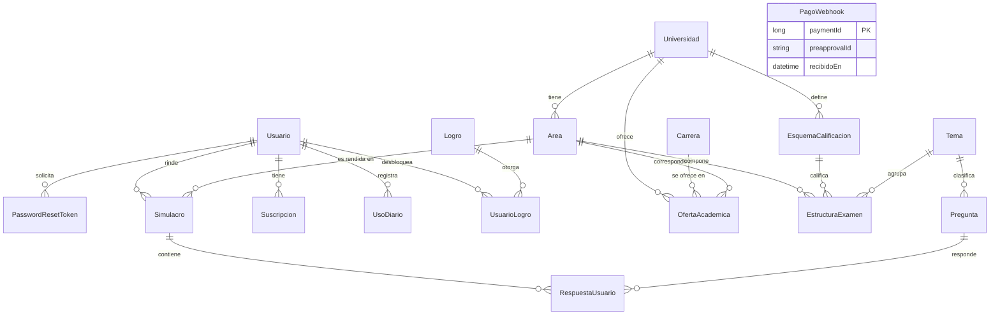

# RumboU — Plataforma de preparación para el examen de admisión (UNI y UNMSM)

**Curso:** CS2031 Desarrollo Basado en Plataformas — UTEC, ciclo 2026-2
**Entrega:** Proyecto 1 (Semana 7)
**Integrantes:** Marco Bautista, Fabiana Gomez, Juan Carlos Vergara, Zoe Garrido Cantoni
**API en producción:** https://rumbou-backend-production.up.railway.app ([health check](https://rumbou-backend-production.up.railway.app/api/v1/health))
**Colección de Postman:** [`postman_collection.json`](postman_collection.json) (raíz del repositorio)

> Este documento es el informe de la entrega y, a la vez, la documentación técnica del proyecto. Las secciones 1 a 10 siguen la estructura pedida por la rúbrica; los apéndices contienen la guía de instalación, el despliegue y la referencia de la API.

---

## Índice

1. [Introducción](#1-introducción)
2. [Identificación del problema o necesidad](#2-identificación-del-problema-o-necesidad)
3. [Descripción de la solución](#3-descripción-de-la-solución)
4. [Modelo de entidades](#4-modelo-de-entidades)
5. [Manejo de errores](#5-manejo-de-errores)
6. [Medidas de seguridad implementadas](#6-medidas-de-seguridad-implementadas)
7. [Eventos y asincronía](#7-eventos-y-asincronía)
8. [GitHub y gestión del proyecto](#8-github-y-gestión-del-proyecto)
9. [Conclusión](#9-conclusión)
10. [Apéndices](#10-apéndices)
    - [A. Instalación y ejecución local](#a-instalación-y-ejecución-local)
    - [B. Despliegue](#b-despliegue)
    - [C. Referencia de la API y colección de Postman](#c-referencia-de-la-api-y-colección-de-postman)
    - [D. Licencia](#d-licencia)
    - [E. Referencias](#e-referencias)

---

## 1. Introducción

### Contexto

En el Perú, el ingreso a universidades públicas como la UNI y la UNMSM se decide en un examen de admisión muy competitivo. Cada universidad —e incluso cada área dentro de ella— tiene su propia estructura de prueba, su propio puntaje con penalidad por respuesta incorrecta y un puntaje de corte por carrera que cambia en cada proceso. Prepararse bien exige practicar bajo las reglas exactas del examen real y saber qué tan lejos se está del puntaje que ingresó en procesos anteriores.

RumboU es una API REST en Spring Boot que sirve de backend a una plataforma de preparación para estos exámenes, cubriendo a la UNI (área General) y a la UNMSM (áreas B y C). No incluye frontend: la API se consume y se demuestra desde la colección de Postman.

### Objetivos del proyecto

- Rendir simulacros que repliquen el examen real de cada universidad y área: mismas preguntas por tema, mismo valor de acierto y de penalidad.
- Traducir el puntaje simulado en una medida de avance: el Puntaje Simulado Proyectado (PSP) y el Índice de Progreso (IP) respecto al último ingresante de la carrera.
- Mantener un banco de preguntas propio, generado con apoyo de IA y revisado por una persona.
- Incentivar la constancia con racha diaria, XP y logros.
- Sostener el servicio con un modelo freemium: plan gratuito con límites y plan PRO con simulacros ilimitados y tutor de IA.

---

## 2. Identificación del problema o necesidad

### Descripción del problema

Los postulantes se preparan con material genérico que no refleja la estructura de puntaje de la universidad a la que postulan: una misma pregunta de matemática vale y penaliza distinto en la UNI y en la UNMSM. Tampoco existe una forma clara de traducir un puntaje simulado a "qué tan cerca estoy de ingresar a mi carrera", porque eso depende del puntaje del último ingresante, que cambia cada proceso y por carrera.

### Justificación

Una preparación de calidad suele estar limitada a quienes pueden pagar una academia. Una plataforma que modele las reglas de cada examen como datos configurables, y no como código, permite llegar a más personas y hace que agregar otra universidad sea un cambio de datos, no de arquitectura. Esa es la regla central del proyecto: ningún valor de puntaje, penalidad o corte de admisión vive en el código.

---

## 3. Descripción de la solución

### Funcionalidades implementadas

- **Autenticación y roles:** registro, login, JWT con el rol embebido, refresh tokens, recuperación de contraseña con token de un solo uso y administración de roles `USER`/`ADMIN`.
- **Motor de simulacros:** genera la prueba desde la estructura real del área, recibe respuestas, califica con la penalidad del esquema y calcula el PSP. Probado contra los cuatro esquemas reales de UNI y UNMSM.
- **Banco de preguntas:** CRUD por rol, filtros paginados y generación con Gemini con validación automática y aprobación humana obligatoria. Contiene **792 preguntas aprobadas** (36 por tema en 22 temas), suficientes para los simulacros completos de la UNI (180) y la UNMSM (100).
- **Catálogo académico reproducible:** universidades, áreas, esquemas, temas, estructura del examen, 51 carreras y 70 ofertas con el puntaje del último ingresante, cargados desde CSV con un seed idempotente.
- **Suscripción PRO:** `PlanService` como puerta única de límites, preaprobación de pago en Mercado Pago, webhook idempotente, activación por evento y un job diario que vence suscripciones.
- **Tutor de IA:** explicación personalizada con Gemini para el plan PRO (con tope diario) y una explicación estática generada una vez por pregunta fallada.
- **Gamificación:** racha diaria, XP y logros al terminar cada simulacro.
- **Correo transaccional:** registro, recuperación de contraseña y pago aprobado, con plantillas Thymeleaf enviadas de forma asíncrona.
- **Despliegue continuo:** contenedor Docker en Railway con PostgreSQL en la nube; cada merge a `main` despliega.

**Pendiente:** el cálculo del Índice de Progreso (IP) y del dominio por tema, con sus endpoints de panel.

### Tecnologías utilizadas

| Capa | Tecnología |
|---|---|
| Lenguaje y framework | Java 21, Spring Boot 3.3.5, Maven |
| Persistencia | Spring Data JPA, Hibernate, PostgreSQL 16 (Docker en local, gestionado en la nube) |
| Seguridad | Spring Security, JWT (jjwt) con access y refresh tokens, BCrypt |
| Integraciones | Google Gemini (generación de preguntas y tutor), Mercado Pago (suscripciones), JavaMailSender + Thymeleaf (correo) |
| Pruebas | JUnit 5, Mockito, MockMvc, TestContainers |
| Entrega | GitHub Actions (CI), Docker, Railway, Postman |

### Arquitectura y organización del código

El código está organizado **por capas**: cada paquete contiene un solo tipo de componente y una petición las atraviesa en orden (`controller` → `service` → `repository` → `entity`).

```
com.rumbou.backend
  config/        SecurityConfig, AsyncConfig, SchedulingConfig
  controller/    7 controllers REST bajo /api/v1 (22 endpoints)
  dto/           request/ (12) y response/ (11): lo que entra y sale de la API
  entity/        17 entidades JPA y 10 enums
  exception/     8 excepciones propias + GlobalExceptionHandler
  repository/    interfaces Spring Data JPA
  security/      filtro JWT, servicio de tokens, UserDetailsService, entry point 401
  service/       lógica de negocio
  event/         5 eventos de dominio; listener/ sus 6 oyentes
  seed/          carga del catálogo y del banco de preguntas desde CSV
  client/        clientes de Gemini y Mercado Pago
  scheduler/     tareas programadas
```

Patrones aplicados: **inyección de dependencias por constructor**; **patrón Repository** con Spring Data; **DTOs especializados** por caso de uso (`PreguntaResponse` oculta la clave al postulante; `PreguntaAdminResponse` la incluye), de modo que ningún endpoint recibe ni devuelve entidades; **Bean Validation** en los DTOs de entrada; **arquitectura dirigida por eventos** entre módulos (sección 7); y un **motor de calificación dirigido por datos**: `CalificadorService` recibe el esquema como parámetro y no tiene un solo condicional por universidad.

---

## 4. Modelo de entidades

### Diagrama



### Descripción

Son 17 entidades JPA con `id` heredado de `BaseEntity`, agrupadas por el módulo al que sirven:

| Entidad | Módulo | Qué representa |
|---|---|---|
| `Usuario` | Autenticación | Cuenta del postulante: rol, racha, XP y bloqueo optimista (`@Version`) |
| `PasswordResetToken` | Autenticación | Token de un solo uso para restablecer la contraseña (30 min) |
| `Universidad`, `Area`, `Carrera` | Académico | Catálogo base |
| `OfertaAcademica` | Académico | M:N con atributos (universidad, carrera, área): puntaje del último ingresante por proceso |
| `EsquemaCalificacion` | Académico | Acierto, penalidad y puntaje máximo de un bloque, como dato |
| `Tema` | Académico | Tema con su temario oficial (guía al generador de preguntas) |
| `EstructuraExamen` | Académico | Preguntas por tema en cada área y con qué esquema se califican |
| `Pregunta` | Contenido | Pertenece a un tema, no a una universidad: el mismo banco sirve para ambas |
| `Simulacro`, `RespuestaUsuario` | Examen | M:N con atributos: cada respuesta guarda su puntaje aportado, que puede ser negativo |
| `Suscripcion`, `UsoDiario`, `PagoWebhook` | Suscripción | Plan del usuario, contadores diarios (`@Version`) y pagos ya procesados (idempotencia) |
| `Logro`, `UsuarioLogro` | Gamificación | Catálogo de logros y cuáles desbloqueó cada usuario |

Los enums (`Role`, `Plan`, `EstadoSuscripcion`, `TipoSimulacro`, `Dificultad`, `OrigenPregunta`, etc.) se persisten como texto (`EnumType.STRING`) para que la base sea legible y no dependa del orden de declaración.

---

## 5. Manejo de errores

Todos los errores se resuelven en un único `@RestControllerAdvice` (`GlobalExceptionHandler`); ningún controller tiene `try/catch`. La respuesta siempre es un `ErrorResponse` (`timestamp`, `status`, `error`, `message`, `path`). Las excepciones propias están organizadas por categoría:

| Categoría | Excepción | HTTP |
|---|---|---|
| Recurso | `ResourceNotFoundException` | 404 |
| Recurso | `DuplicateResourceException` | 409 |
| Autenticación | `InvalidCredentialsException` | 401 |
| Autenticación | `InvalidTokenException` | 401 |
| Autorización y límites de plan | `UnauthorizedException` | 403 |
| Reglas de negocio | `InvalidOperationException` | 400 |
| Servicios externos | `ExternalServiceException` | 502 |
| Servicios externos | `GeminiException` (hereda de la anterior) | 502 |

El mismo handler cubre las de Spring: `BadCredentialsException` (401), `AccessDeniedException` (403, cuando `@PreAuthorize` rechaza el rol), `MethodArgumentNotValidException` (400, con el detalle de `@Valid`), `HttpMessageNotReadableException` (400, JSON mal formado), `NoResourceFoundException` (404) y un respaldo genérico (500). Los errores de terceros responden 502 sin exponer la respuesta cruda del proveedor.

---

## 6. Medidas de seguridad implementadas

### Seguridad de datos

- **Contraseñas** hasheadas con `BCryptPasswordEncoder`; ningún DTO de respuesta incluye el hash.
- **JWT stateless:** access token de 15 minutos y refresh token de 7 días, firmados con una clave HMAC que viene de `JWT_SECRET`.
- **Roles en dos lugares:** en la base de datos y dentro del JWT, para autorizar cada petición sin una consulta adicional.
- **Autorización por método:** `@PreAuthorize("hasRole('ADMIN')")` sobre los endpoints sensibles (gestión de preguntas, búsqueda de usuarios y cambio de roles), con `@EnableMethodSecurity`. Los límites del plan se verifican en `PlanService`, no en el controller.
- **Alta de administradores controlada:** el registro público solo crea cuentas `USER`; el primer `ADMIN` nace de `ADMIN_EMAIL`/`ADMIN_PASSWORD` al arrancar, solo un administrador promueve a otros y ninguno puede quitarse su propio rol.
- **Recuperación de contraseña:** token de un solo uso que expira a los 30 minutos y que invalida los anteriores; el endpoint responde igual exista o no el correo, para no revelar qué cuentas existen.
- **Secretos fuera del repositorio:** base de datos, clave JWT, Gemini, Mercado Pago y SMTP se leen de variables de entorno.

### Prevención de vulnerabilidades

- **Inyección SQL:** todas las consultas pasan por Spring Data JPA / Hibernate con parámetros preparados; ninguna se construye por concatenación.
- **XSS:** la API solo devuelve JSON y nunca renderiza HTML con datos del usuario; toda entrada pasa por Bean Validation.
- **CSRF:** desactivado deliberadamente porque la API es stateless y no usa cookies; la autenticación es siempre por header `Authorization: Bearer`.
- **CORS:** configurado explícitamente; abierto en desarrollo, a restringir al dominio del cliente antes de un uso real.
- **401 uniformes:** un `AuthenticationEntryPoint` propio devuelve 401 (no el 403 por defecto de Spring) con el mismo `ErrorResponse`.

---

## 7. Eventos y asincronía

Los módulos no se llaman entre sí: se comunican publicando eventos con `ApplicationEventPublisher`, lo que permitió avanzar en paralelo y mantiene desacoplados examen, gamificación, contenido, suscripciones y correo.

| Evento | Lo publica | Lo escucha | Modo |
|---|---|---|---|
| `SimulacroFinalizadoEvent` | `SimulacroService` | `GamificacionListener` (racha, XP, logros) | Síncrono, misma transacción |
| `RespuestaIncorrectaEvent` | `SimulacroService` | `TutorIaExplicacionListener` (cachea una explicación) | `@Async` + `AFTER_COMMIT` |
| `PagoAprobadoEvent` | `WebhookService` | `SuscripcionActivacionListener` (activa el plan), `PagoAprobadoCorreoListener` (correo) | `AFTER_COMMIT` |
| `PasswordResetRequestedEvent` | `AuthService` | `RecuperacionContrasenaCorreoListener` (correo) | `@Async` + `AFTER_COMMIT` |
| `UsuarioRegistradoEvent` | `AuthService` | `RegistroConfirmacionListener` (correo de bienvenida) | `@Async` + `AFTER_COMMIT` |

Los oyentes que llaman a un tercero (Gemini, SMTP) son `@Async` sobre un pool propio (`AsyncConfig`), para que la respuesta HTTP no espere. Los que dependen de datos recién escritos usan `AFTER_COMMIT` y, si escriben en la base, abren su propia transacción con `REQUIRES_NEW`, porque en esa fase la original ya se cerró. Además, `SuscripcionVencimientoJob` (`@Scheduled`, 3 a.m.) marca como vencidas las suscripciones cuya fecha de fin pasó.

---

## 8. GitHub y gestión del proyecto

- **Flujo de trabajo:** `main` protegida, una rama por funcionalidad (`feat/`, `fix/`, `refactor/`, `chore/`) y merge solo por pull request: 31 integrados, todos con el CI en verde.
- **Integración continua:** `.github/workflows/ci.yml` ejecuta `mvnw verify` en cada push y pull request. La suite tiene 151 pruebas en 25 clases: unitarias (JUnit + Mockito), de capa web (`@WebMvcTest`), de repositorio y seed contra PostgreSQL real (TestContainers) y una prueba de humo que levanta la aplicación completa.
- **Issues, labels y milestone:** 17 issues en el milestone "Entrega Semana 7", con labels por módulo (`auth`, `examen`, `contenido`, `academico`, `progreso`, `suscripcion`, `gamificacion`, `correo`, `seed`, `deployment`), por tipo (`rubrica`, `seguridad`, `testing`, `documentation`, `decision`) y de proceso (`Permiso común`, `Coordinar con Marco`).
- **Reparto:** Marco (autenticación, examen, banco de preguntas), Juan Carlos (catálogo académico, progreso), Zoe (suscripción, gamificación, correo) y Fabiana (contenido, primera etapa). Cada persona responde por sus clases y avisa antes de editar una ajena.

---

## 9. Conclusión

### Logros del proyecto

La API cubre de punta a punta el flujo del postulante: registrarse, rendir un simulacro con la estructura y calificación reales de su universidad, ver su puntaje proyectado, acumular racha y XP, y pasar a PRO para usar el tutor de IA. El banco tiene 792 preguntas validadas y aprobadas por una persona, las 151 pruebas corren en cada pull request y el sistema está desplegado con base de datos en la nube y despliegue continuo.

### Aprendizajes clave

- Modelar las reglas del examen como datos permitió soportar dos universidades con puntajes distintos sin un condicional por universidad.
- `@TransactionalEventListener(AFTER_COMMIT)` no se combina con `@Transactional` por defecto; la solución (`REQUIRES_NEW`) quedó documentada en el código.
- Un CI en verde no garantiza que la aplicación arranque: los tests por rebanada no cargan el contexto completo. Una prueba de humo con `@SpringBootTest` cerró ese hueco.
- Con una cuota de IA de 20 llamadas diarias, el diseño del generador importó más que el modelo: pedir un tema completo por llamada y validar por lotes bajó las llamadas de 330 a 44.
- Reorganizar el proyecto por capas a mitad de camino fue posible porque los tests cubrían el comportamiento, no la estructura de carpetas.

### Trabajo futuro

- Completar el cálculo de progreso (IP y dominio por tema) y su panel.
- Migrar el despliegue a AWS (EC2 + RDS) con la misma imagen Docker y restringir CORS al dominio del frontend.
- Sumar más universidades como cambio de datos y ampliar la gamificación con ligas semanales.

---

## 10. Apéndices

### A. Instalación y ejecución local

**Requisitos:** Java 21, Docker Desktop y el wrapper de Maven incluido (`mvnw`).

1. **Base de datos.** `docker compose up -d` levanta PostgreSQL en el puerto **5433** del host (no el 5432, para no chocar con instalaciones nativas de Windows, que producen un `password authentication failed` engañoso). Las credenciales de desarrollo están en `docker-compose.yml` y coinciden con `application.properties`.
2. **Catálogo y banco de preguntas.** `./mvnw spring-boot:run "-Dspring-boot.run.profiles=seed"` carga desde `src/main/resources/seed/` las universidades, áreas, esquemas, temas, estructura del examen, carreras, ofertas, logros y las 792 preguntas. Es idempotente y los runners corren en orden (académico → logros → preguntas).
3. **Aplicación.** `./mvnw spring-boot:run` o la clase `BackendApplication` desde el IDE. Queda en `http://localhost:8080`.
4. **Pruebas.** `./mvnw test` con Docker abierto (TestContainers). El `pom.xml` fija `testcontainers.version` en 1.21.4 porque la versión que trae Spring Boot 3.3 no es compatible con Docker Desktop 29 en Windows.

**Variables de entorno** (todas con valor por defecto de desarrollo; ninguna credencial real está en el repositorio):

| Variable | Para qué | Cuándo hace falta |
|---|---|---|
| `SPRING_DATASOURCE_URL`, `SPRING_DATASOURCE_USERNAME`, `SPRING_DATASOURCE_PASSWORD` | Conexión a PostgreSQL | Producción |
| `JWT_SECRET` | Firma de los tokens | Producción |
| `PORT` | Puerto HTTP (lo inyecta la plataforma) | Producción |
| `SHOW_SQL` | Imprimir el SQL de Hibernate | Opcional (`false` en producción) |
| `ADMIN_EMAIL`, `ADMIN_PASSWORD` | Crear el primer administrador al arrancar | Primer despliegue |
| `GEMINI_API_KEY`, `GEMINI_MODEL` | Generador de preguntas y tutor de IA | Al usar la IA |
| `MP_ACCESS_TOKEN` | Preaprobación de pago en Mercado Pago | Al crear suscripciones PRO |
| `MAIL_HOST`, `MAIL_PORT`, `MAIL_USERNAME`, `MAIL_PASSWORD` | Correo SMTP | Al enviar correos reales |

La aplicación arranca aunque falten las de Gemini, Mercado Pago y correo; esas funciones responden 502 hasta que se configuran.

**Generar más preguntas** (requiere `GEMINI_API_KEY`): `./mvnw spring-boot:run "-Dspring-boot.run.profiles=generar-preguntas" "-Dspring-boot.run.arguments=--todos --cantidad=12"` pide a Gemini las preguntas que faltan por tema y dificultad, las valida y las guarda sin aprobar. Tras revisarlas y aprobarlas (`PATCH /api/v1/preguntas/aprobar-lote`), el profile `exportar-preguntas` vuelca las aprobadas a `seed/preguntas.csv` para versionarlas.

### B. Despliegue

La API está desplegada en **Railway** con PostgreSQL gestionado dentro del mismo proyecto y conectado por red privada:

- **Contenedor propio:** el `Dockerfile` compila el jar en una etapa de build con Maven y produce una imagen final solo con el runtime de Java 21.
- **Despliegue continuo:** cada merge a `main` construye y despliega una nueva versión; el CI corre antes, sobre el pull request.
- **Configuración por variables de entorno:** las mismas de la tabla anterior, cargadas en el panel de la plataforma.
- **Datos cargados:** el seed se ejecuta en producción activando temporalmente `SPRING_PROFILES_ACTIVE=seed` y volviendo a desplegar.
- **Portabilidad:** la misma imagen puede moverse a AWS (EC2 o ECS + RDS) cambiando solo las variables de entorno.

Al abrir la URL raíz se recibe un `401` en JSON, que es la respuesta esperada porque casi todos los recursos exigen token; `GET /api/v1/health` responde `200` sin token y es el health check de la plataforma.

### C. Referencia de la API y colección de Postman

Todas las rutas están versionadas bajo `/api/v1`, con recursos en plural. Las marcadas con 🔒 requieren `Authorization: Bearer <accessToken>`; las marcadas con 👑 requieren además el rol `ADMIN`.

| Método y ruta | Descripción |
|---|---|
| `GET /health` | Estado del servicio (público) |
| `POST /auth/register` | Crear cuenta (`USER`); devuelve access y refresh token |
| `POST /auth/login` | Iniciar sesión |
| `POST /auth/refresh` | Renovar el access token con el refresh token |
| `POST /auth/forgot-password` | Solicitar el correo de recuperación |
| `POST /auth/reset-password` | Cambiar la contraseña con el token recibido |
| 🔒 `GET /usuarios/me` | Datos y rol de la cuenta del token |
| 👑 `GET /usuarios?email=` | Buscar una cuenta por correo |
| 👑 `PATCH /usuarios/{id}/rol` | Cambiar el rol de una cuenta |
| 🔒 `POST /simulacros` | Iniciar un simulacro (`COMPLETO`, `POR_TEMA` o `DIAGNOSTICO`) para un área |
| 🔒 `POST /simulacros/{id}/respuestas` | Responder una pregunta (`null` = en blanco) |
| 🔒 `POST /simulacros/{id}/finalizar` | Calificar y obtener puntaje y PSP |
| 🔒 `GET /preguntas` | Listar preguntas con filtros y paginación |
| 🔒 `GET /preguntas/{id}` | Ver una pregunta |
| 👑 `POST /preguntas` · `PUT /preguntas/{id}` · `DELETE /preguntas/{id}` | Crear, actualizar y eliminar |
| 👑 `PATCH /preguntas/{id}/aprobar` · `PATCH /preguntas/aprobar-lote` | Aprobar una o varias preguntas |
| 🔒 `POST /preguntas/{id}/tutor-ia` | Explicación del tutor de IA (plan PRO) |
| 🔒 `POST /suscripciones` | Crear la suscripción PRO y obtener el enlace de pago |
| `POST /webhooks/mercadopago` | Notificación de pago de Mercado Pago (público, idempotente) |

La colección [`postman_collection.json`](postman_collection.json) documenta cada request con descripción, ejemplos y validaciones. Se importa en Postman y funciona sin configuración adicional: la variable `baseUrl` apunta a producción (`baseUrlLocal` a `localhost:8080`), la autorización Bearer está definida a nivel de colección y los scripts de prueba guardan automáticamente `accessToken`, `refreshToken`, `usuarioId`, `simulacroId` y `preguntaId` al ejecutar los requests correspondientes.

### D. Licencia

Proyecto académico desarrollado para el curso CS2031 Desarrollo Basado en Plataformas (UTEC). Su uso está restringido al contexto académico del curso; no cuenta con una licencia de código abierto.

### E. Referencias

- Spring Boot y Spring Security — [spring.io/projects/spring-boot](https://spring.io/projects/spring-boot)
- Spring Data JPA — [spring.io/projects/spring-data-jpa](https://spring.io/projects/spring-data-jpa)
- TestContainers — [testcontainers.com](https://testcontainers.com)
- API de Gemini (Google AI Studio) — [ai.google.dev/gemini-api/docs](https://ai.google.dev/gemini-api/docs)
- Mercado Pago para desarrolladores — [mercadopago.com.pe/developers](https://www.mercadopago.com.pe/developers)
- Prospectos de admisión de la UNI y la UNMSM (estructura del examen, esquemas de calificación y puntajes de ingreso por carrera).
